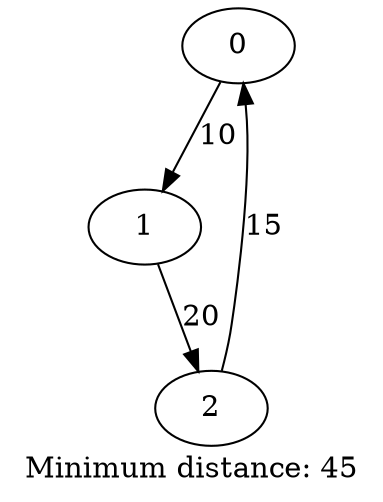

# Подробное объяснение кода задачи коммивояжера

## Оглавление
1. [Общая структура программы](#общая-структура-программы)
2. [Основные концепции C++](#основные-концепции-c)
3. [Разбор файла tsp.h](#разбор-файла-tsph)
4. [Разбор файла tsp.cpp](#разбор-файла-tspcpp)
5. [Разбор файла main.cpp](#разбор-файла-maincpp)
6. [Алгоритм работы](#алгоритм-работы)
7. [FAQ для новичков](#faq-для-новичков)

---

## Общая структура программы

Программа состоит из трех файлов:

```
tsp.h       - Заголовочный файл (объявления функций и структур)
tsp.cpp     - Реализация функций алгоритма
main.cpp    - Точка входа программы
```

**Зачем разделять на файлы?**
- **tsp.h** - интерфейс (что программа умеет делать)
- **tsp.cpp** - реализация (как именно это делается)
- **main.cpp** - использование (где вызываются функции)

Это стандартная практика в C++ для организации больших проектов.

---

## Основные концепции C++

### 1. Что такое `#include`?

```cpp
#include "tsp.h"
#include <iostream>
```

`#include` - это директива препроцессора, которая **копирует** содержимое указанного файла на место этой строки.

- `#include "file.h"` - включить **свой** файл (из текущей папки)
- `#include <file>` - включить **системный** файл (из стандартной библиотеки)

**Пример:** Когда компилятор видит `#include <iostream>`, он копирует весь код библиотеки iostream (для работы с вводом/выводом) в вашу программу.

### 2. Что такое `std::`?

```cpp
std::vector<int> myVector;
std::cout << "Hello";
```

`std` - это **namespace** (пространство имен) стандартной библиотеки C++.

**Зачем это нужно?** Чтобы избежать конфликтов имен. Например, у вас может быть своя функция `vector`, а у стандартной библиотеки - своя. `std::` говорит компилятору: "используй версию из стандартной библиотеки".

**Альтернатива:** Можно написать `using namespace std;` в начале файла, тогда не нужно будет каждый раз писать `std::`. Но это плохая практика для больших проектов!

### 3. Что такое `vector`?

```cpp
std::vector<int> numbers;
```

`vector` - это **динамический массив** из стандартной библиотеки (STL).

**Отличия от обычного массива:**
- Может изменять размер во время выполнения программы
- Автоматически управляет памятью (не нужно вручную выделять/освобождать)
- Имеет много полезных методов

**Пример:**
```cpp
std::vector<int> v;
v.push_back(10);     // Добавить элемент в конец
v.push_back(20);
int size = v.size(); // Узнать размер (2)
int first = v[0];    // Получить элемент (10)
```

### 4. Двумерный вектор (матрица)

```cpp
std::vector<std::vector<int>> graph;
```

Это **вектор векторов** = двумерный массив (матрица).

**Визуально:**
```
graph[0] → [0, 10, 15]
graph[1] → [10, 0, 20]
graph[2] → [15, 20, 0]
```

**Доступ к элементу:**
```cpp
int distance = graph[1][2]; // Строка 1, столбец 2 → 20
```

### 5. Что такое `const`?

```cpp
const std::vector<int>& path
```

`const` = константа = "не изменяется".

**Зачем использовать?**
1. Защита от случайного изменения данных
2. Компилятор может лучше оптимизировать код
3. Показывает намерение программиста

**Пример:**
```cpp
void printVector(const std::vector<int>& v) {
    v[0] = 100; // ОШИБКА! const запрещает изменение
    std::cout << v[0]; // OK, чтение разрешено
}
```

### 6. Что такое `&` (ссылка)?

```cpp
void loadGraph(const std::string& filename, std::vector<std::vector<int>>& graph)
```

`&` после типа означает **ссылку** (reference).

**Без ссылки (копирование):**
```cpp
void foo(std::vector<int> v) {
    // v - это КОПИЯ исходного вектора
    // Изменения v не повлияют на оригинал
}
```

**Со ссылкой:**
```cpp
void foo(std::vector<int>& v) {
    // v - это ТОТ ЖЕ вектор (не копия!)
    // Изменения v изменят оригинал
}
```

**Зачем использовать ссылки?**
1. **Производительность:** Не копируется весь вектор (может быть огромным!)
2. **Изменение оригинала:** Можно изменять переданные данные

**`const &` = "передай по ссылке, но не изменяй"**
- Быстро (нет копирования)
- Безопасно (нельзя случайно изменить)

### 7. Что такое `static_cast`?

```cpp
int n = static_cast<int>(path.size());
```

`static_cast<T>()` - это **явное преобразование типа** (type casting).

**Проблема:**
```cpp
size_t size = path.size(); // size_t - беззнаковое целое (0, 1, 2, ...)
int n = size;              // Компилятор предупреждает: можем потерять данные!
```

**Решение:**
```cpp
int n = static_cast<int>(size); // Явно говорим: "Я понимаю, что делаю"
```

**Почему `size()` возвращает `size_t`, а не `int`?**
- `size_t` - беззнаковый тип, может хранить очень большие числа
- `int` может быть отрицательным (не нужно для размера!)
- Стандарт C++ так решил

### 8. Что такое `auto`?

```cpp
auto result = solveTSP(graph);
```

`auto` - компилятор **сам определяет тип** переменной.

**Эквивалентно:**
```cpp
TSPResult result = solveTSP(graph);
```

**Когда использовать:**
- Когда тип очевиден из правой части
- Когда тип слишком длинный

**Не злоупотреблять!** Код должен оставаться читаемым.

---

## Разбор файла tsp.h

### Что такое заголовочный файл?

Заголовочный файл (`.h` или `.hpp`) содержит:
- Объявления функций (что функция делает, какие параметры принимает)
- Определения структур и классов
- Константы

**НЕ содержит реализацию функций!** (реализация в `.cpp`)

### `#pragma once`

```cpp
#pragma once
```

**Зачем?** Предотвращает повторное включение файла.

**Проблема без `#pragma once`:**
Если два файла включают `tsp.h`, компилятор попытается определить структуры дважды → ошибка.

**`#pragma once` говорит:** "Включи этот файл только один раз, даже если на него много ссылок"

### Структура TSPResult

```cpp
struct TSPResult {
    std::vector<int> bestPath;  // Оптимальный маршрут
    int minDistance;            // Минимальная длина маршрута
};
```

**Что такое `struct`?**
`struct` = структура = группа переменных, объединенных вместе.

**Зачем?** Удобно возвращать несколько значений из функции.

**Использование:**
```cpp
TSPResult result;
result.bestPath = {0, 1, 2};
result.minDistance = 45;

std::cout << result.minDistance; // Доступ к полю
```

**`struct` vs `class`:** В C++ почти одно и то же. Разница:
- `struct` - по умолчанию поля `public` (доступны всем)
- `class` - по умолчанию поля `private` (доступны только внутри класса)

### Объявление функции loadGraph

```cpp
bool loadGraph(const std::string& filename, std::vector<std::vector<int>>& graph);
```

**Разбор по частям:**

1. **`bool`** - тип возвращаемого значения
   - `true` = загрузка успешна
   - `false` = ошибка

2. **`loadGraph`** - имя функции

3. **`const std::string& filename`** - первый параметр
   - `std::string` = строка (текст)
   - `const &` = передается по ссылке, не изменяется
   - `filename` = имя переменной

4. **`std::vector<std::vector<int>>& graph`** - второй параметр
   - Матрица смежности
   - `&` БЕЗ `const` = можем изменять (функция заполнит граф данными!)

**Почему `graph` без `const`?**
Функция `loadGraph` ИЗМЕНЯЕТ граф, заполняя его данными из файла. Поэтому нужна НЕ константная ссылка.

---

## Разбор файла tsp.cpp

### Функция loadGraph

```cpp
bool loadGraph(const std::string& filename, std::vector<std::vector<int>>& graph) {
    std::ifstream file(filename);
    if (!file.is_open()) {
        std::cerr << "Error: Cannot open file " << filename << std::endl;
        return false;
    }
```

**Построчный разбор:**

#### Строка 1: Открытие файла
```cpp
std::ifstream file(filename);
```

- `ifstream` = **Input File Stream** = поток для чтения из файла
- Создаем объект `file`, передавая имя файла в конструктор
- Файл автоматически открывается

#### Строка 2-5: Проверка открытия
```cpp
if (!file.is_open()) {
    std::cerr << "Error: Cannot open file " << filename << std::endl;
    return false;
}
```

- `file.is_open()` - проверяет, открылся ли файл
- `!` - оператор отрицания (NOT)
- `!file.is_open()` = "если файл НЕ открыт"
- `std::cerr` - поток для вывода ошибок (похож на `cout`, но для ошибок)
- `std::endl` - перевод строки + сброс буфера
- `return false` - выходим из функции с кодом "ошибка"

**Почему `cerr`, а не `cout`?**
- `cout` - для обычного вывода
- `cerr` - для ошибок (не буферизируется, выводит сразу)

#### Чтение количества вершин
```cpp
int n;
file >> n;

if (n <= 0) {
    std::cerr << "Error: Invalid number of vertices" << std::endl;
    return false;
}
```

- `file >> n` - читает целое число из файла в переменную `n`
- Проверяем корректность (должно быть > 0)

**Оператор `>>`:** "извлечь из потока"
```cpp
int x;
std::cin >> x;  // Читаем из консоли
file >> x;      // Читаем из файла
```

#### Выделение памяти для матрицы
```cpp
graph.resize(n, std::vector<int>(n));
```

**Что происходит?**
1. `graph.resize(n, ...)` - изменяет размер вектора на `n` элементов
2. `std::vector<int>(n)` - создает вектор из `n` целых чисел (все = 0)
3. Итого: создается матрица n×n, заполненная нулями

**Визуально для n=3:**
```
graph = [ [0, 0, 0],
          [0, 0, 0],
          [0, 0, 0] ]
```

#### Чтение матрицы
```cpp
for (int i = 0; i < n; i++) {
    for (int j = 0; j < n; j++) {
        file >> graph[i][j];
    }
}
```

**Вложенные циклы:**
- Внешний цикл (`i`) - перебирает строки
- Внутренний цикл (`j`) - перебирает столбцы
- `file >> graph[i][j]` - читает число и кладет в ячейку [i][j]

**Порядок чтения:**
```
[0][0], [0][1], [0][2],  ← первая строка
[1][0], [1][1], [1][2],  ← вторая строка
[2][0], [2][1], [2][2]   ← третья строка
```

#### Закрытие файла
```cpp
file.close();
return true;
```

- `file.close()` - закрывает файл (освобождает ресурсы)
- `return true` - возвращаем "успех"

**Нужно ли явно вызывать `close()`?**
Необязательно! Деструктор `ifstream` автоматически закроет файл. Но явный вызов - хорошая практика.

---

### Функция calculatePathLength

```cpp
int calculatePathLength(const std::vector<std::vector<int>>& graph, const std::vector<int>& path) {
    int length = 0;
    int n = static_cast<int>(path.size());
```

**Что делает функция?**
Вычисляет общую длину маршрута, проходя по всем ребрам.

**Параметры:**
- `graph` - матрица расстояний (const & = не изменяется)
- `path` - последовательность вершин, например [0, 2, 1]

**Возвращаемое значение:**
- Длина маршрута (int)
- -1, если маршрут невозможен

#### Вычисление длины пути
```cpp
for (int i = 0; i < n - 1; i++) {
    int from = path[i];
    int to = path[i + 1];

    if (graph[from][to] == 0 && from != to) {
        return -1;  // Нет пути между вершинами
    }

    length += graph[from][to];
}
```

**Пошагово для path = [0, 2, 1]:**

1. **i = 0:**
   - `from = path[0] = 0`
   - `to = path[1] = 2`
   - Проверяем: `graph[0][2] != 0` (есть ребро)
   - `length += graph[0][2]` (добавляем расстояние 0→2)

2. **i = 1:**
   - `from = path[1] = 2`
   - `to = path[2] = 1`
   - `length += graph[2][1]` (добавляем расстояние 2→1)

**Почему `i < n - 1`?**
Потому что мы смотрим на `path[i + 1]`. Если `i = n`, то `path[n]` выйдет за границы массива!

**Проверка `graph[from][to] == 0 && from != to`:**
- `graph[from][to] == 0` - нет ребра
- `from != to` - но это не петля (вершина в саму себя)
- Если оба условия верны → маршрут невозможен

#### Замыкание цикла
```cpp
int from = path[n - 1];
int to = path[0];

if (graph[from][to] == 0 && from != to) {
    return -1;
}

length += graph[from][to];
```

**Зачем?**
Задача коммивояжера требует вернуться в начальный город!

**Для path = [0, 2, 1]:**
- Последняя вершина: `path[2] = 1`
- Первая вершина: `path[0] = 0`
- Добавляем ребро 1→0

**Итоговый маршрут:** 0→2→1→0 (замкнутый цикл)

---

### Функция solveTSP

```cpp
TSPResult solveTSP(const std::vector<std::vector<int>>& graph) {
    TSPResult result;
    result.minDistance = std::numeric_limits<int>::max();
```

**Инициализация:**
- Создаем структуру `result` для хранения ответа
- `std::numeric_limits<int>::max()` = максимальное значение для типа `int`
- **Зачем максимум?** Чтобы любое найденное расстояние было меньше

**Аналогия:** Ищем минимум среди чисел. Начальное значение = бесконечность, чтобы первое же число стало новым минимумом.

#### Создание начальной перестановки
```cpp
int n = static_cast<int>(graph.size());

if (n == 0) {
    result.minDistance = 0;
    return result;
}

std::vector<int> vertices(n);
for (int i = 0; i < n; i++) {
    vertices[i] = i;
}
```

**Что создается:**
Для n=4: `vertices = [0, 1, 2, 3]`

**Зачем?**
Это начальная последовательность вершин. Дальше будем генерировать все перестановки.

#### Перебор всех перестановок
```cpp
do {
    int currentLength = calculatePathLength(graph, vertices);

    if (currentLength != -1 && currentLength < result.minDistance) {
        result.minDistance = currentLength;
        result.bestPath = vertices;
    }
} while (std::next_permutation(vertices.begin(), vertices.end()));
```

**Что такое `std::next_permutation`?**
Функция из STL, которая генерирует следующую перестановку в лексикографическом порядке.

**Пример для [0, 1, 2]:**
```
Перестановка 1: [0, 1, 2]
Перестановка 2: [0, 2, 1]
Перестановка 3: [1, 0, 2]
Перестановка 4: [1, 2, 0]
Перестановка 5: [2, 0, 1]
Перестановка 6: [2, 1, 0]
```

**Как работает цикл `do-while`?**
```cpp
do {
    // Тело цикла выполняется
} while (условие);
```

1. Выполнить тело цикла
2. Проверить условие
3. Если `true` - повторить, если `false` - выйти

**Отличие от `while`:**
- `while` - проверка ДО выполнения
- `do-while` - проверка ПОСЛЕ выполнения (тело выполнится хотя бы раз!)

**Что происходит в цикле:**

1. Вычисляем длину текущего маршрута
2. Если маршрут валиден (`!= -1`) И короче текущего минимума:
   - Обновляем `minDistance`
   - Сохраняем `bestPath`
3. Генерируем следующую перестановку
4. Если перестановки закончились - `next_permutation` вернет `false` → выход из цикла

**Сколько итераций?**
Для n вершин: **n!** (факториал) перестановок
- n=3: 6 перестановок
- n=4: 24 перестановки
- n=5: 120 перестановок
- n=10: 3 628 800 перестановок 😱

---

### Функция saveGraphviz

```cpp
bool saveGraphviz(const std::string& filename,
                  const std::vector<std::vector<int>>& graph,
                  const TSPResult& result) {
    std::ofstream file(filename);
```

**`std::ofstream`:** Output File Stream = поток для записи в файл

**Аналогия с `ifstream`:**
- `ifstream` - читаем ИЗ файла
- `ofstream` - пишем В файл

#### Вывод в формате DOT
```cpp
file << "digraph TSP {" << std::endl;
```

**Оператор `<<`:** "вставить в поток"
```cpp
std::cout << "Hello";  // Вывод в консоль
file << "Hello";       // Вывод в файл
```

**`digraph TSP {`:** Начало описания ориентированного графа в формате Graphviz DOT

#### Вывод рёбер
```cpp
int n = static_cast<int>(result.bestPath.size());
for (int i = 0; i < n; i++) {
    int from = result.bestPath[i];
    int to = result.bestPath[(i + 1) % n];
    int weight = graph[from][to];

    file << "    " << from << " -> " << to
         << " [label=\"" << weight << "\"];" << std::endl;
}
```

**Разбор:**

1. **`(i + 1) % n`** - оператор остатка от деления (modulo)
   - Зачем? Для замыкания цикла!
   - Когда `i = n-1`: `(n-1 + 1) % n = n % n = 0` (вернулись к началу!)

**Пример для n=3:**
```
i=0: to = (0+1) % 3 = 1
i=1: to = (1+1) % 3 = 2
i=2: to = (2+1) % 3 = 0  ← замкнули цикл!
```

2. **Формат вывода:**
```
    0 -> 1 [label="10"];
```
- `0 -> 1` - ребро из вершины 0 в вершину 1
- `[label="10"]` - подпись ребра (вес = 10)

#### Вывод метки с расстоянием
```cpp
file << "    label = \"Minimum distance: " << result.minDistance << "\";" << std::endl;
file << "}" << std::endl;
```

Закрываем граф и добавляем общую метку.

---

## Разбор файла main.cpp

### Функция main

```cpp
int main(int argc, char* argv[]) {
```

**Параметры main:**
- `argc` (argument count) - количество аргументов командной строки
- `argv` (argument vector) - массив строк с аргументами

**Пример запуска:**
```bash
./tsp input.txt output.dot
```

- `argc = 3`
- `argv[0] = "./tsp"` (имя программы)
- `argv[1] = "input.txt"`
- `argv[2] = "output.dot"`

**Тип `char*`:**
- `char` - символ
- `char*` - указатель на символ = строка в стиле C
- `char* argv[]` - массив строк

#### Проверка аргументов
```cpp
if (argc != 3) {
    std::cerr << "Usage: " << argv[0] << " <input_file> <output_file>" << std::endl;
    std::cerr << "Example: " << argv[0] << " input.txt output.dot" << std::endl;
    return 1;
}
```

**Почему `argc != 3`, а не 2?**
Потому что `argv[0]` - это имя программы! Нужно: имя + 2 файла = 3 аргумента.

**`return 1`:**
- `return 0` - программа завершилась успешно
- `return 1` (или другое ненулевое) - ошибка

#### Загрузка графа
```cpp
std::vector<std::vector<int>> graph;
if (!loadGraph(inputFile, graph)) {
    return 1;
}
```

**Почему `graph` передается БЕЗ инициализации?**
Функция `loadGraph` сама создаст нужный размер матрицы с помощью `resize`.

**Проверка `if (!loadGraph(...))`:**
- Если `loadGraph` вернула `false` → ошибка → выходим

#### Вывод результата
```cpp
for (size_t i = 0; i < result.bestPath.size(); i++) {
    std::cout << result.bestPath[i];
    if (i < result.bestPath.size() - 1) {
        std::cout << " -> ";
    }
}
std::cout << " -> " << result.bestPath[0] << std::endl;
```

**Что выводит:**
```
0 -> 1 -> 3 -> 2 -> 0
```

**Почему `i < size() - 1`?**
Чтобы не выводить стрелку после последнего элемента.

**Почему отдельно `<< result.bestPath[0]`?**
Чтобы показать замыкание цикла (возврат в начальную вершину).

---

## Алгоритм работы

### Пошаговый пример

Дан граф:
```
3 вершины
Матрица:
  0  10  15
 10   0  20
 15  20   0
```

### Шаг 1: Загрузка
- Открываем файл
- Читаем n=3
- Создаем матрицу 3×3
- Заполняем её из файла

### Шаг 2: Решение TSP
1. Инициализация:
   ```
   minDistance = ∞
   vertices = [0, 1, 2]
   ```

2. Перестановка 1: [0, 1, 2]
   ```
   Путь: 0→1 (10) + 1→2 (20) + 2→0 (15) = 45
   45 < ∞ → обновляем минимум
   minDistance = 45
   bestPath = [0, 1, 2]
   ```

3. Перестановка 2: [0, 2, 1]
   ```
   Путь: 0→2 (15) + 2→1 (20) + 1→0 (10) = 45
   45 = 45 → не обновляем
   ```

4. Перестановки 3-6: аналогично, все пути длины 45

5. **Результат:** minDistance = 45, bestPath = [0, 1, 2]

### Шаг 3: Сохранение
Создаем файл output.dot:


---

## FAQ для новичков

### 1. Почему используется `std::vector`, а не обычный массив?

**Обычный массив:**
```cpp
int arr[100]; // Размер фиксирован!
```
Проблемы:
- Нельзя изменить размер
- Нужно вручную управлять памятью (new/delete)
- Легко выйти за границы

**Вектор:**
```cpp
std::vector<int> v;
v.push_back(10); // Динамически растет
```
Плюсы:
- Размер меняется автоматически
- Автоматическое управление памятью
- Методы: `size()`, `empty()`, `push_back()`, etc.

### 2. Зачем нужны const и &?

**Без `const &`:**
```cpp
void process(std::vector<int> v) {
    // v - это КОПИЯ вектора
    // Копирование = медленно!
}
```

**С `const &`:**
```cpp
void process(const std::vector<int>& v) {
    // v - ссылка на оригинал
    // Быстро + безопасно (const защищает от изменений)
}
```

### 3. Что делает `std::next_permutation`?

Генерирует следующую перестановку в лексикографическом порядке.

**Пример:**
```cpp
std::vector<int> v = {1, 2, 3};

do {
    // Вывести текущую перестановку
    for (int x : v) std::cout << x << " ";
    std::cout << "\n";
} while (std::next_permutation(v.begin(), v.end()));

// Вывод:
// 1 2 3
// 1 3 2
// 2 1 3
// 2 3 1
// 3 1 2
// 3 2 1
```

### 4. Почему функция возвращает `bool`?

Чтобы сообщить об успехе или ошибке:
```cpp
bool loadGraph(...) {
    if (ошибка) {
        return false; // Не удалось
    }
    return true; // Успех
}

// Использование:
if (!loadGraph(...)) {
    std::cerr << "Ошибка загрузки!\n";
    return 1;
}
```

Альтернатива - исключения (exceptions), но для учебной программы `bool` проще.

### 5. Что значит `for (int i = 0; i < n; i++)`?

**Синтаксис for:**
```cpp
for (инициализация; условие; шаг) {
    тело цикла
}
```

**Эквивалент while:**
```cpp
int i = 0;           // инициализация
while (i < n) {      // условие
    // тело цикла
    i++;             // шаг
}
```

**`i++`** означает `i = i + 1` (увеличить на 1)

### 6. Можно ли улучшить алгоритм?

Да! Переборный алгоритм очень медленный для больших графов.

**Улучшения:**
1. **Метод ветвей и границ** (Branch and Bound)
2. **Динамическое программирование** (алгоритм Хелда-Карпа) - O(n² × 2ⁿ)
3. **Приближенные алгоритмы:**
   - Жадный алгоритм
   - Алгоритм 2-приближения через MST
4. **Эвристики:**
   - Генетические алгоритмы
   - Имитация отжига
   - Муравьиный алгоритм

Но переборный алгоритм дает **точное** решение!

### 7. Что такое `.begin()` и `.end()`?

Это **итераторы** - указатели на элементы вектора.

```cpp
std::vector<int> v = {10, 20, 30};

// .begin() - указывает на первый элемент
// .end() - указывает ПОСЛЕ последнего элемента

auto it = v.begin();
std::cout << *it; // Вывод: 10

it++;
std::cout << *it; // Вывод: 20
```

**Зачем?**
Для работы с алгоритмами STL (например, `next_permutation`, `sort`).

### 8. Почему в `main` используется `return 0` или `return 1`?

Это **код возврата** (exit code) программы.

**В терминале (Linux/Mac):**
```bash
./tsp input.txt output.dot
echo $?  # Выведет код возврата
```

**Соглашение:**
- `0` - успех
- Ненулевое значение - ошибка

**Зачем?**
Скрипты могут проверять, успешно ли выполнилась программа:
```bash
if ./tsp input.txt output.dot; then
    echo "Успех!"
else
    echo "Ошибка!"
fi
```

### 9. Что делает оператор `%` (modulo)?

Возвращает остаток от деления:
```cpp
7 % 3 = 1   (7 ÷ 3 = 2 остаток 1)
10 % 5 = 0  (делится нацело)
5 % 10 = 5  (5 < 10, остаток = само число)
```

**В нашем коде:**
```cpp
int to = result.bestPath[(i + 1) % n];
```

**Зачем?**
Для замыкания цикла! Когда `i = n-1`:
```
(n-1 + 1) % n = n % n = 0
```
Возвращаемся к первой вершине.

### 10. Как работает `std::numeric_limits<int>::max()`?

Возвращает максимальное значение для типа `int`.

```cpp
#include <limits>

int max_int = std::numeric_limits<int>::max();
// max_int = 2147483647 (для 32-битного int)
```

**Зачем в нашем коде?**
Инициализируем `minDistance` максимальным значением, чтобы любое найденное расстояние было меньше.

---

## Дополнительные темы

### Почему не используется `using namespace std;`?

**С `using`:**
```cpp
using namespace std;
vector<int> v;  // Можно писать без std::
```

**Без `using`:**
```cpp
std::vector<int> v;  // Нужен префикс std::
```

**Проблема `using namespace std;`:**
- В больших проектах может возникнуть конфликт имен
- Считается плохой практикой

**Когда можно использовать:**
- В маленьких учебных программах
- Внутри функций (не в заголовочных файлах!)

### Что такое деструктор?

Деструктор - функция, которая автоматически вызывается при уничтожении объекта.

```cpp
{
    std::ifstream file("input.txt");
    // Работаем с файлом
} // Здесь деструктор ~ifstream() автоматически закроет файл!
```

**Зачем?**
Автоматическое освобождение ресурсов (файлы, память, и т.д.).

### Что такое RAII?

**RAII** = Resource Acquisition Is Initialization

**Идея:** Захватить ресурс в конструкторе, освободить в деструкторе.

**Пример:**
```cpp
std::ifstream file("input.txt");  // Конструктор открывает файл
// ... работаем ...
// Деструктор автоматически закроет файл
```

**Плюсы:**
- Нет утечек ресурсов
- Не нужно помнить про `close()`, `delete`, и т.д.

---

## Заключение

Эта программа демонстрирует основные концепции C++:
- Работа с STL контейнерами (`vector`)
- Передача параметров (по значению, по ссылке, константные ссылки)
- Работа с файлами (`ifstream`, `ofstream`)
- Структуры данных
- Алгоритмы STL (`next_permutation`)
- Модульность (разделение на файлы)

Понимание этих концепций - ключ к написанию хорошего C++ кода!

---

**Есть вопросы?** Перечитай соответствующий раздел. Если что-то непонятно - попробуй написать небольшой тестовый код и поэкспериментировать!
