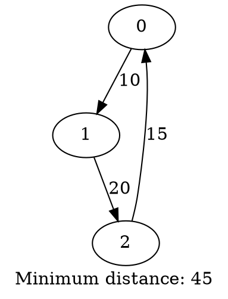
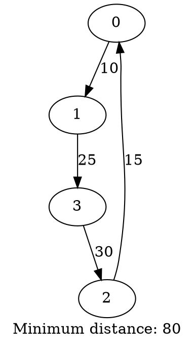

# 🎓 ПОЛНЫЙ ГАЙД ПО ЗАЩИТЕ КУРСОВОЙ РАБОТЫ
## Задача коммивояжера - Переборный алгоритм

---

# 📋 СОДЕРЖАНИЕ

1. [ЧТО ТАКОЕ ЗАДАЧА КОММИВОЯЖЕРА](#1-что-такое-задача-коммивояжера)
2. [КАК РАБОТАЕТ АЛГОРИТМ](#2-как-работает-алгоритм)
3. [КАК РАБОТАЕТ КОД](#3-как-работает-код)
4. [ПОШАГОВАЯ ИНСТРУКЦИЯ ДЛЯ ЗАЩИТЫ](#4-пошаговая-инструкция-для-защиты)
5. [ДЕМОНСТРАЦИЯ ПРОГРАММЫ](#5-демонстрация-программы)
6. [ВОЗМОЖНЫЕ ВОПРОСЫ И ОТВЕТЫ](#6-возможные-вопросы-и-ответы)
7. [КРАТКАЯ ШПАРГАЛКА](#7-краткая-шпаргалка)
8. [СТРАТЕГИИ ЕСЛИ НЕ ЗНАЕШЬ ОТВЕТА](#8-стратегии-если-не-знаешь-ответа)

---

# 1. ЧТО ТАКОЕ ЗАДАЧА КОММИВОЯЖЕРА

## 1.1. Простыми словами

**Представь:** У тебя есть несколько городов на карте. Ты коммивояжер (продавец), который должен:
- Посетить **все города** ровно по одному разу
- Вернуться в **начальный город**
- Пройти **минимальное расстояние**

**Пример из жизни:**
Курьер Яндекс.Еды должен развезти 5 заказов по разным адресам и вернуться на базу. Как выбрать порядок доставки, чтобы проехать меньше всего километров?

## 1.2. Формальное определение (для защиты)

**Говори так:**
> "Задача коммивояжера - это классическая задача комбинаторной оптимизации. Дан полный взвешенный граф с N вершинами. Нужно найти замкнутый маршрут минимальной длины, который проходит через каждую вершину ровно один раз и возвращается в начальную вершину."

**Разбор терминов:**
- **Граф** = набор точек (вершин) и связей (рёбер) между ними
- **Взвешенный** = у каждого ребра есть вес (расстояние)
- **Полный граф** = между любыми двумя вершинами есть прямое ребро
- **Замкнутый маршрут** = начинаем и заканчиваем в одной точке

## 1.3. Почему это важная задача?

**Скажи на защите:**
> "Эта задача имеет множество практических применений: логистика, маршрутизация, производство печатных плат, планирование расписаний. Она также важна в теории алгоритмов как NP-полная задача."

**Что значит NP-полная?** (если спросят)
Это значит, что нет известного алгоритма, который решает задачу быстро для больших данных. Приходится либо долго считать точное решение, либо искать приближённое.

---

# 2. КАК РАБОТАЕТ АЛГОРИТМ

## 2.1. Идея переборного алгоритма

**Самое главное:**
Мы просто **перебираем ВСЕ возможные маршруты**, считаем длину каждого и выбираем самый короткий.

**Говори так:**
> "Я реализовал переборный алгоритм, также известный как brute force. Алгоритм генерирует все возможные перестановки вершин, для каждой вычисляет длину маршрута и запоминает минимальную."

## 2.2. Пошаговый пример (ВЫУЧИ ЭТОТ ПРИМЕР!)

**На защите можешь нарисовать такой граф на бумаге:**

```
Дан граф с 3 городами (0, 1, 2):

    0 ----10---- 1
     \          /
      15      20
       \      /
         \  /
          2

Расстояния (матрица смежности):
     0   1   2
  0 [0  10  15]
  1 [10  0  20]
  2 [15 20  0]
```

**Объясняй пошагово:**

### Шаг 1: Список всех возможных маршрутов
> "Начнём с города 0. Всего есть 6 способов обойти 3 города:"

1. 0 → 1 → 2 → 0
2. 0 → 2 → 1 → 0
3. 1 → 0 → 2 → 1
4. 1 → 2 → 0 → 1
5. 2 → 0 → 1 → 2
6. 2 → 1 → 0 → 2

> "Но заметим, что маршруты 1 и 6 - это один и тот же цикл, только начинаются с разных городов. Алгоритм перебирает все перестановки, начиная с города 0."

### Шаг 2: Вычисляем длину каждого маршрута

**Маршрут 0 → 1 → 2 → 0:**
- 0 → 1: расстояние 10
- 1 → 2: расстояние 20
- 2 → 0: расстояние 15
- **Итого: 10 + 20 + 15 = 45**

**Маршрут 0 → 2 → 1 → 0:**
- 0 → 2: расстояние 15
- 2 → 1: расстояние 20
- 1 → 0: расстояние 10
- **Итого: 15 + 20 + 10 = 45**

> "Как видим, для этого симметричного графа оба маршрута имеют одинаковую длину - 45."

### Шаг 3: Выбираем минимальный
> "Алгоритм сравнивает все длины и выбирает минимальную. В данном случае минимум = 45, маршрут: 0 → 1 → 2 → 0."

## 2.3. Как работает генерация перестановок?

**Важно понять:**
Вместо того, чтобы писать все перестановки вручную, мы используем функцию `std::next_permutation` из стандартной библиотеки C++.

**Скажи так:**
> "Для генерации всех перестановок я использовал функцию `std::next_permutation` из библиотеки STL. Она автоматически генерирует следующую перестановку в лексикографическом порядке."

**Пример работы next_permutation:**
```
Начальная перестановка: [0, 1, 2]
После 1-го вызова:      [0, 2, 1]
После 2-го вызова:      [1, 0, 2]
После 3-го вызова:      [1, 2, 0]
После 4-го вызова:      [2, 0, 1]
После 5-го вызова:      [2, 1, 0]
После 6-го вызова:      вернёт false (все перестановки закончились)
```

## 2.4. Сложность алгоритма

**ОЧЕНЬ ВАЖНО ДЛЯ ЗАЩИТЫ!**

**Временная сложность: O(n · n!)**

**Объясни так:**
> "Временная сложность алгоритма составляет O(n · n!), где n - количество вершин. Здесь n! - это количество перестановок, а n - время на вычисление длины одного маршрута."

**Расшифровка:**
- **n!** (n факториал) = количество перестановок n элементов
  - 3! = 6
  - 4! = 24
  - 5! = 120
  - 10! = 3 628 800
  - 15! = 1 307 674 368 000 (больше триллиона!)

- **n** = для каждой перестановки мы проходим по n рёбрам и суммируем их веса

**Скажи также:**
> "Пространственная сложность - O(n²) для хранения матрицы смежности плюс O(n) для хранения текущей перестановки."

**Почему это важно:**
> "Из-за факториальной сложности алгоритм применим только для небольших графов - практически до 12-15 вершин. Для больших графов нужны эвристические или приближённые алгоритмы."

---

# 3. КАК РАБОТАЕТ КОД

## 3.1. Общая структура программы

**Скажи так:**
> "Программа разделена на три файла согласно требованиям: заголовочный файл tsp.h с объявлениями, файл реализации tsp.cpp и главный файл main.cpp с точкой входа."

### Файлы:
1. **tsp.h** - объявления функций и структур (интерфейс)
2. **tsp.cpp** - реализация алгоритма
3. **main.cpp** - точка входа, работа с пользователем

**Зачем так разделять?**
> "Это стандартная практика в C++ для модульности и переиспользования кода. Заголовочный файл описывает ЧТО программа делает, а cpp-файл - КАК именно."

## 3.2. Структура TSPResult

```cpp
struct TSPResult {
    std::vector<int> bestPath;  // Оптимальный маршрут
    int minDistance;            // Минимальная длина маршрута
};
```

**Объясни:**
> "Я создал структуру TSPResult для удобного возврата результата из функции solveTSP. Она хранит два значения: вектор с последовательностью вершин оптимального маршрута и целое число - длину этого маршрута."

**Зачем структура?**
> "В C++ функция может возвращать только одно значение. Структура позволяет вернуть сразу два связанных значения как единый объект."

## 3.3. Функция loadGraph()

**Сигнатура:**
```cpp
bool loadGraph(const std::string& filename, std::vector<std::vector<int>>& graph);
```

**Что делает:**
> "Функция loadGraph загружает граф из файла в матрицу смежности. Возвращает true при успехе, false при ошибке."

**Параметры:**
- `filename` - имя файла (передаётся по константной ссылке для эффективности)
- `graph` - матрица смежности (передаётся по ссылке, чтобы функция могла её заполнить)

**Как работает (пошагово):**

### Шаг 1: Открытие файла
```cpp
std::ifstream file(filename);
if (!file.is_open()) {
    std::cerr << "Error: Cannot open file " << filename << std::endl;
    return false;
}
```
> "Создаём объект ifstream для чтения. Если файл не открылся - выводим ошибку в stderr и возвращаем false."

### Шаг 2: Чтение количества вершин
```cpp
int n;
file >> n;
if (n <= 0) {
    std::cerr << "Error: Invalid number of vertices" << std::endl;
    return false;
}
```
> "Читаем первое число из файла - количество вершин. Проверяем, что оно положительное."

### Шаг 3: Выделение памяти для матрицы
```cpp
graph.resize(n, std::vector<int>(n));
```
> "Создаём двумерный вектор размером n×n. Метод resize создаёт n строк, каждая из которых - вектор из n целых чисел, инициализированных нулями."

### Шаг 4: Чтение матрицы
```cpp
for (int i = 0; i < n; i++) {
    for (int j = 0; j < n; j++) {
        file >> graph[i][j];
    }
}
```
> "Двумя вложенными циклами читаем матрицу построчно. Внешний цикл - по строкам, внутренний - по столбцам."

**Формат входного файла:**
```
<количество вершин>
<матрица n×n>
```

Пример:
```
3
0 10 15
10 0 20
15 20 0
```

## 3.4. Функция calculatePathLength()

**Сигнатура:**
```cpp
int calculatePathLength(const std::vector<std::vector<int>>& graph,
                        const std::vector<int>& path);
```

**Что делает:**
> "Функция вычисляет длину заданного маршрута - сумму весов всех рёбер в пути. Возвращает -1, если маршрут невозможен (нет ребра между какими-то вершинами)."

**Параметры:**
- `graph` - матрица расстояний (константная ссылка)
- `path` - последовательность вершин, например [0, 2, 1]

**Как работает:**

### Шаг 1: Инициализация
```cpp
int length = 0;
int n = static_cast<int>(path.size());
```
> "Начинаем с длины 0. Преобразуем size() к int с помощью static_cast, чтобы избежать предупреждений компилятора."

**Почему static_cast?**
> "Метод size() возвращает тип size_t (беззнаковое целое), а мы используем int. Static_cast - это явное преобразование типа, которое говорит компилятору: 'Я понимаю, что делаю'."

### Шаг 2: Суммируем рёбра
```cpp
for (int i = 0; i < n - 1; i++) {
    int from = path[i];
    int to = path[i + 1];

    if (graph[from][to] == 0 && from != to) {
        return -1;  // Нет пути
    }

    length += graph[from][to];
}
```
> "Проходим по всем последовательным парам вершин в пути. Для каждой пары берём расстояние из матрицы и добавляем к общей длине. Если расстояние = 0 и это не петля (вершина в саму себя), значит пути нет."

**Почему i < n - 1?**
> "Потому что мы смотрим на пары (i, i+1). Если i = n, то i+1 выйдет за границы массива!"

### Шаг 3: Замыкаем цикл
```cpp
int from = path[n - 1];
int to = path[0];

if (graph[from][to] == 0 && from != to) {
    return -1;
}

length += graph[from][to];
```
> "Задача коммивояжера требует вернуться в начальный город. Поэтому отдельно добавляем ребро от последней вершины к первой."

**Пример:**
- Путь: [0, 2, 1]
- Вычисляем: graph[0][2] + graph[2][1] + graph[1][0]

## 3.5. Функция solveTSP() - КЛЮЧЕВАЯ ФУНКЦИЯ!

**Сигнатура:**
```cpp
TSPResult solveTSP(const std::vector<std::vector<int>>& graph);
```

**Что делает:**
> "Это главная функция, которая реализует переборный алгоритм. Она генерирует все возможные перестановки вершин, вычисляет длину каждого маршрута и находит минимальную."

**Как работает (ПОДРОБНО, ВЫУЧИ ЭТО!):**

### Шаг 1: Инициализация результата
```cpp
TSPResult result;
result.minDistance = std::numeric_limits<int>::max();
```
> "Создаём структуру для результата. Инициализируем minDistance максимально возможным значением для типа int - это примерно 2 миллиарда."

**Зачем максимум?**
> "Чтобы любое найденное расстояние было меньше начального значения. Это стандартный приём при поиске минимума."

### Шаг 2: Создаём начальную перестановку
```cpp
int n = static_cast<int>(graph.size());

if (n == 0) {
    result.minDistance = 0;
    return result;
}

std::vector<int> vertices(n);
for (int i = 0; i < n; i++) {
    vertices[i] = i;
}
```
> "Создаём вектор [0, 1, 2, ..., n-1] - начальную последовательность вершин. Если граф пустой, возвращаем результат с нулевым расстоянием."

### Шаг 3: Перебираем все перестановки (ГЛАВНЫЙ ЦИКЛ!)
```cpp
do {
    int currentLength = calculatePathLength(graph, vertices);

    if (currentLength != -1 && currentLength < result.minDistance) {
        result.minDistance = currentLength;
        result.bestPath = vertices;
    }
} while (std::next_permutation(vertices.begin(), vertices.end()));
```

**Разбор по строчкам:**

#### Строка 1: do-while цикл
> "Использую цикл do-while, потому что нужно обработать начальную перестановку, а потом проверить условие."

**do-while vs while:**
- `while` - сначала проверка, потом тело
- `do-while` - сначала тело, потом проверка (выполнится хотя бы раз!)

#### Строка 2: Вычисляем длину текущего маршрута
```cpp
int currentLength = calculatePathLength(graph, vertices);
```
> "Для текущей перестановки вызываем функцию вычисления длины."

#### Строки 3-6: Обновляем минимум
```cpp
if (currentLength != -1 && currentLength < result.minDistance) {
    result.minDistance = currentLength;
    result.bestPath = vertices;
}
```
> "Проверяем два условия: маршрут возможен (не -1) И он короче текущего минимума. Если оба условия выполнены - обновляем результат."

**Почему проверяем != -1?**
> "Потому что calculatePathLength возвращает -1, если маршрут невозможен (нет какого-то ребра). Такие маршруты нам не нужны."

#### Строка 7: Генерируем следующую перестановку
```cpp
while (std::next_permutation(vertices.begin(), vertices.end()));
```

**Что делает next_permutation:**
1. Переставляет элементы вектора на следующую перестановку
2. Возвращает `true`, если перестановка сгенерирована
3. Возвращает `false`, если это была последняя перестановка

**Пример работы:**
```
Итерация 1: vertices = [0, 1, 2], currentLength = 45
next_permutation() → vertices = [0, 2, 1], возвращает true

Итерация 2: vertices = [0, 2, 1], currentLength = 45
next_permutation() → vertices = [1, 0, 2], возвращает true

...

Итерация 6: vertices = [2, 1, 0], currentLength = 45
next_permutation() → вернёт false, цикл завершится
```

### Шаг 4: Возврат результата
```cpp
return result;
```
> "После перебора всех перестановок возвращаем структуру с оптимальным маршрутом и минимальным расстоянием."

## 3.6. Функция saveGraphviz()

**Сигнатура:**
```cpp
bool saveGraphviz(const std::string& filename,
                  const std::vector<std::vector<int>>& graph,
                  const TSPResult& result);
```

**Что делает:**
> "Функция сохраняет результат в файл в формате Graphviz DOT для визуализации. Это текстовый формат описания графов, который можно преобразовать в картинку."

**Формат Graphviz DOT:**


**Как работает:**

### Шаг 1: Открытие файла для записи
```cpp
std::ofstream file(filename);
if (!file.is_open()) {
    std::cerr << "Error: Cannot open file " << filename << std::endl;
    return false;
}
```
> "Создаём объект ofstream (output file stream) для записи в файл. Проверяем успешность открытия."

### Шаг 2: Начало графа
```cpp
file << "digraph TSP {" << std::endl;
```
> "Записываем заголовок. digraph означает directed graph - ориентированный граф. TSP - имя графа."

### Шаг 3: Вывод рёбер оптимального маршрута
```cpp
int n = static_cast<int>(result.bestPath.size());
for (int i = 0; i < n; i++) {
    int from = result.bestPath[i];
    int to = result.bestPath[(i + 1) % n];
    int weight = graph[from][to];

    file << "    " << from << " -> " << to
         << " [label=\"" << weight << "\"];" << std::endl;
}
```

**Разбор по строчкам:**

#### Строка 3: Замыкание цикла с помощью %
```cpp
int to = result.bestPath[(i + 1) % n];
```

**Оператор % (modulo) - остаток от деления:**
- 5 % 3 = 2 (5 делится на 3, остаток 2)
- 7 % 3 = 1
- 9 % 3 = 0

**Зачем здесь?**
> "Когда i = n-1 (последний элемент), то (i+1) = n. Но n % n = 0! Таким образом мы получаем первую вершину и замыкаем цикл."

**Пример для n=3:**
```
i=0: to = (0+1) % 3 = 1
i=1: to = (1+1) % 3 = 2
i=2: to = (2+1) % 3 = 0  ← Вернулись к началу!
```

#### Строка 5-6: Форматирование вывода
```cpp
file << "    " << from << " -> " << to
     << " [label=\"" << weight << "\"];" << std::endl;
```
> "Выводим ребро в формате: 'from -> to [label=\"weight\"];'. Четыре пробела для отступа, стрелка -> показывает направление, label - подпись ребра."

### Шаг 4: Метка с общим расстоянием
```cpp
file << "    label = \"Minimum distance: " << result.minDistance << "\";" << std::endl;
```
> "Добавляем общую метку графа с минимальным расстоянием."

### Шаг 5: Закрытие графа
```cpp
file << "}" << std::endl;
file.close();
return true;
```
> "Закрываем блок графа фигурной скобкой, закрываем файл и возвращаем true."

## 3.7. Функция main()

**Сигнатура:**
```cpp
int main(int argc, char* argv[])
```

**Параметры:**
- `argc` - количество аргументов командной строки (argument count)
- `argv` - массив строк с аргументами (argument vector)

**Пример запуска:**
```bash
./tsp input.txt output.dot
```
- `argc = 3`
- `argv[0] = "./tsp"` (имя программы)
- `argv[1] = "input.txt"`
- `argv[2] = "output.dot"`

**Что делает main:**

### Шаг 1: Проверка аргументов
```cpp
if (argc != 3) {
    std::cerr << "Usage: " << argv[0] << " <input_file> <output_file>" << std::endl;
    std::cerr << "Example: " << argv[0] << " input.txt output.dot" << std::endl;
    return 1;
}
```
> "Проверяем, что передано ровно 2 аргумента (плюс имя программы = 3). Если нет - выводим подсказку и возвращаем код ошибки 1."

**Почему return 1?**
> "В Unix-системах return 0 означает успех, а любое ненулевое значение - ошибку. Операционная система и скрипты могут проверять код возврата."

### Шаг 2: Загрузка графа
```cpp
std::vector<std::vector<int>> graph;
if (!loadGraph(inputFile, graph)) {
    return 1;
}
```
> "Создаём пустую матрицу, вызываем loadGraph для её заполнения. Если загрузка неудачна - завершаем программу с кодом ошибки."

### Шаг 3: Решение задачи
```cpp
std::cout << "Solving TSP..." << std::endl;
TSPResult result = solveTSP(graph);

if (result.bestPath.empty()) {
    std::cerr << "Error: No solution found" << std::endl;
    return 1;
}
```
> "Вызываем solveTSP, сохраняем результат. Проверяем, что найден маршрут (вектор не пустой)."

### Шаг 4: Вывод результата в консоль
```cpp
std::cout << "Optimal path: ";
for (size_t i = 0; i < result.bestPath.size(); i++) {
    std::cout << result.bestPath[i];
    if (i < result.bestPath.size() - 1) {
        std::cout << " -> ";
    }
}
std::cout << " -> " << result.bestPath[0] << std::endl;
std::cout << "Minimum distance: " << result.minDistance << std::endl;
```
> "Выводим маршрут в удобочитаемом формате: '0 -> 1 -> 2 -> 0'. Последнюю стрелку и первую вершину выводим отдельно, чтобы показать замыкание цикла."

### Шаг 5: Сохранение в файл
```cpp
if (!saveGraphviz(outputFile, graph, result)) {
    return 1;
}

std::cout << "Result saved to " << outputFile << std::endl;
return 0;
```
> "Вызываем saveGraphviz для записи результата. При успехе выводим сообщение и возвращаем 0 - код успешного завершения."

---

# 4. ПОШАГОВАЯ ИНСТРУКЦИЯ ДЛЯ ЗАЩИТЫ

## 4.1. ПОДГОТОВКА (за день до защиты)

### Что сделать:
1. **Прочитай этот файл целиком** 2-3 раза
2. **Выучи пример с 3 городами** из раздела 2.2
3. **Запусти программу** хотя бы на одном тесте
4. **Посмотри на код** - убедись, что можешь показать основные функции
5. **Перечитай раздел 6** (Вопросы и ответы)

### Минимум что нужно помнить:
- Что такое задача коммивояжера (своими словами)
- Сложность: O(n · n!)
- Используется std::next_permutation
- Программа состоит из 3 файлов, 5 функций

## 4.2. СТРУКТУРА ЗАЩИТЫ (15-20 минут)

### Часть 1: Вступление (2 минуты)

**Скажи примерно так:**

> "Здравствуйте! Я выполнил курсовую работу на тему 'Задача коммивояжера - переборный алгоритм'.
>
> Задача коммивояжера - это классическая задача комбинаторной оптимизации. Дан взвешенный граф, нужно найти замкнутый маршрут минимальной длины, который проходит через каждую вершину ровно один раз.
>
> Я реализовал переборный алгоритм, который гарантирует нахождение точного решения путём перебора всех возможных маршрутов."

**Если преподаватель кивает - продолжай. Если молчит - спроси:**
> "Можно я сначала объясню алгоритм, а потом покажу код?"

### Часть 2: Объяснение алгоритма (3-5 минут)

**Возьми лист бумаги и нарисуй граф из 3 вершин:**

```
    0
   /  \
 10    15
 /      \
1--20---2
```

**Говори и показывай:**

> "Давайте рассмотрю работу алгоритма на примере графа с тремя городами."
>
> [Рисуешь граф]
>
> "Алгоритм работает следующим образом:
>
> 1. Сначала генерируем все возможные перестановки вершин. Для трёх городов это 6 вариантов.
>
> 2. Для каждой перестановки вычисляем длину маршрута. Например, маршрут 0-1-2-0:
>    - Идём из 0 в 1: расстояние 10
>    - Из 1 в 2: расстояние 20
>    - Из 2 возвращаемся в 0: расстояние 15
>    - Итого: 45
>
> 3. Запоминаем минимальную длину и соответствующий маршрут.
>
> 4. После перебора всех вариантов возвращаем оптимальное решение."

**Обязательно упомяни сложность:**

> "Временная сложность алгоритма - O(n · n!), где n! - количество перестановок. Это экспоненциальный рост:
> - для 5 городов - 120 вариантов
> - для 10 городов - 3.6 миллиона
> - для 15 городов - больше триллиона
>
> Поэтому алгоритм применим только для малых графов, до 12-15 вершин."

### Часть 3: Структура программы (2-3 минуты)

**Покажи файлы (открой папку с кодом):**

> "Программа разделена на три файла согласно требованиям:
>
> 1. **tsp.h** - заголовочный файл с объявлениями функций и структуры TSPResult
> 2. **tsp.cpp** - реализация алгоритма
> 3. **main.cpp** - точка входа, обработка аргументов командной строки
>
> Всего реализовано 5 функций:
> 1. `loadGraph()` - загрузка графа из файла
> 2. `calculatePathLength()` - вычисление длины маршрута
> 3. `solveTSP()` - переборный алгоритм
> 4. `saveGraphviz()` - вывод в формат DOT
> 5. `main()` - точка входа
>
> Также я создал структуру `TSPResult` для хранения результата - маршрута и его длины."

### Часть 4: Демонстрация кода (5-7 минут)

**ВАЖНО: Не читай код построчно! Объясняй общую логику.**

#### 4.4.1. Покажи функцию solveTSP

**Открой tsp.cpp, найди solveTSP:**

> "Это главная функция - сердце программы. Покажу ключевые моменты."

**Показывай пальцем или курсором:**

> "Здесь [показываешь] инициализируем минимум максимальным значением int.
>
> Здесь [показываешь] создаём начальную перестановку - вектор [0, 1, 2, ..., n-1].
>
> А это - главный цикл [показываешь do-while]:
> - Вычисляем длину текущего маршрута
> - Если он короче минимума - обновляем результат
> - Генерируем следующую перестановку с помощью std::next_permutation
>
> Цикл работает, пока есть новые перестановки. Когда они заканчиваются, next_permutation возвращает false и цикл завершается."

#### 4.4.2. Покажи calculatePathLength

> "Эта функция вычисляет длину конкретного маршрута. Она проходит по всем последовательным парам вершин, берёт расстояние из матрицы и суммирует.
>
> Важный момент [показываешь] - здесь отдельно добавляем ребро от последней вершины к первой, чтобы замкнуть цикл. Это требование задачи коммивояжера."

#### 4.4.3. Покажи loadGraph (если попросят)

> "Функция загружает граф из файла. Сначала читаем количество вершин, затем выделяем память для матрицы n×n, и двумя вложенными циклами заполняем её значениями из файла."

### Часть 5: Демонстрация работы (3-5 минут)

**См. раздел 5 этого файла - подробная инструкция по демонстрации**

### Часть 6: Ответы на вопросы

**См. раздел 6 - готовые ответы на типичные вопросы**

## 4.3. ЧТО ДЕЛАТЬ ЕСЛИ НЕРВНИЧАЕШЬ

### Перед защитой:
1. Глубоко вдохни 5 раз
2. Напомни себе: "Код работает, я его понимаю"
3. Если забыл - смотри в этот файл (можно иметь при себе)

### Во время защиты:
- **Говори медленнее, чем тебе кажется нужным**
- Делай паузы между предложениями
- Если запнулся - просто помолчи секунду и начни заново
- Смотри на экран, а не в глаза преподавателю (если стесняешься)

### Фразы-спасалки:
- "Дайте секунду, вспомню точную формулировку..."
- "Позвольте покажу это в коде..."
- "Можно я запущу программу, чтобы показать?"

---

# 5. ДЕМОНСТРАЦИЯ ПРОГРАММЫ

## 5.1. Подготовка к демонстрации

### Что нужно открыть:
1. **Терминал** (командная строка)
2. **Папку с проектом** (чтобы показать файлы)
3. **Текстовый редактор с кодом** (VSCode, Notepad++ или любой другой)
4. **Один из тестовых файлов** (например, test1_in.txt)

### Проверь заранее:
- Программа скомпилирована (`ls -lh tsp` - файл должен быть)
- Тестовые файлы на месте (папка tests/)
- Ты помнишь команду запуска

## 5.2. Пошаговая демонстрация

### Шаг 1: Покажи входной файл

**Открой tests/test1_in.txt:**

```
4
0 10 15 20
10 0 35 25
15 35 0 30
20 25 30 0
```

**Скажи:**
> "Входной файл имеет простой формат:
> - Первая строка - количество вершин, в данном случае 4
> - Далее идёт матрица смежности 4×4, где элемент [i][j] - это расстояние от вершины i до вершины j
> - Матрица симметричная, диагональ нулевая"

**Объясни одну строку:**
> "Например, первая строка матрицы [0 10 15 20] означает:
> - Расстояние от 0 до 0 = 0 (город в самого себя)
> - Расстояние от 0 до 1 = 10
> - Расстояние от 0 до 2 = 15
> - Расстояние от 0 до 3 = 20"

### Шаг 2: Запусти программу

**В терминале набери (медленно, комментируя):**

```bash
./tsp tests/test1_in.txt output_demo.dot
```

**Объясняй:**
> "Запускаю программу с двумя аргументами:
> - Первый аргумент - входной файл с графом
> - Второй аргумент - выходной файл для результата"

**Программа выведет:**
```
Graph loaded successfully. Vertices: 4
Solving TSP...
Optimal path: 0 -> 1 -> 3 -> 2 -> 0
Minimum distance: 80
Result saved to output_demo.dot
```

**Прокомментируй вывод:**
> "Программа сообщает:
> - Граф загружен, 4 вершины
> - Решение найдено: маршрут 0 → 1 → 3 → 2 → 0
> - Минимальная длина = 80
> - Результат сохранён в файл"

### Шаг 3: Покажи выходной файл

**Открой output_demo.dot:**



**Объясни формат:**
> "Это формат Graphviz DOT. Он описывает граф в текстовом виде:
> - `digraph TSP` - начало описания ориентированного графа
> - Каждая строка `0 -> 1 [label="10"]` - это ребро с весом
> - `label = "Minimum distance: 80"` - общая метка графа
>
> Этот файл можно визуализировать с помощью программы Graphviz командой:
> `dot -Tpng output_demo.dot -o result.png`"

### Шаг 4: (Опционально) Покажи визуализацию

**Если есть возможность:**

```bash
dot -Tpng output_demo.dot -o result.png
```

**Открой result.png - покажи граф**

> "Вот визуализация оптимального маршрута. Видно, как мы проходим через все вершины и возвращаемся в начальную точку."

## 5.3. Что могут попросить показать ещё

### "Покажите на другом тесте"

**Готовься запустить test2:**

```bash
./tsp tests/test2_in.txt output2.dot
cat output2.dot
```

### "А что если файла нет?"

**Запусти с несуществующим файлом:**

```bash
./tsp nonexistent.txt output.dot
```

**Программа выведет:**
```
Error: Cannot open file nonexistent.txt
```

**Скажи:**
> "Программа корректно обрабатывает ошибки - выводит сообщение и завершается с кодом ошибки."

### "А что если запустить без аргументов?"

```bash
./tsp
```

**Программа выведет:**
```
Usage: ./tsp <input_file> <output_file>
Example: ./tsp input.txt output.dot
```

**Скажи:**
> "В функции main я проверяю количество аргументов и вывожу подсказку, если они указаны неверно."

## 5.4. Возможные проблемы при демонстрации

### Проблема: "Программа не запускается"

**Причина:** Файл не исполняемый

**Решение:**
```bash
chmod +x tsp
./tsp tests/test1_in.txt output.dot
```

### Проблема: "Нет такого файла tsp"

**Причина:** Не скомпилирована

**Решение:**
```bash
g++ -std=c++11 -o tsp main.cpp tsp.cpp
```

**Скажи:**
> "Сейчас скомпилирую программу. Использую компилятор g++ со стандартом C++11, так как нужна функция std::next_permutation."

### Проблема: "Забыл команду запуска"

**Смотри на экран и говори:**
> "Программа запускается через командную строку... одну секунду, вспомню точный синтаксис..."

**Затем набери:**
```bash
./tsp <input> <output>
```

---

# 6. ВОЗМОЖНЫЕ ВОПРОСЫ И ОТВЕТЫ

## 6.1. О задаче коммивояжера

### Вопрос: "Что такое задача коммивояжера?"

**Ответ:**
> "Задача коммивояжера - это классическая задача комбинаторной оптимизации. Дан полный взвешенный граф с N вершинами. Требуется найти замкнутый маршрут минимальной длины, который проходит через каждую вершину ровно один раз и возвращается в начальную вершину.
>
> Практические применения: маршрутизация транспорта, производство печатных плат, планирование расписаний."

### Вопрос: "Почему эта задача важна?"

**Ответ:**
> "Во-первых, она имеет множество практических применений - от логистики до производства микрочипов.
>
> Во-вторых, это NP-полная задача, что означает отсутствие быстрого алгоритма для больших данных. Она служит эталоном сложности в теории алгоритмов.
>
> В-третьих, для неё разработано множество эвристических методов, которые изучают в курсах оптимизации."

### Вопрос: "Что значит NP-полная задача?"

**Ответ (если знаешь):**
> "NP-полная задача - это задача, для которой не известен полиномиальный алгоритм решения. Проверить решение можно быстро, но найти его - долго. Если кто-то найдёт быстрый алгоритм для TSP, это решит проблему P=NP, одну из важнейших в информатике."

**Ответ (если не знаешь):**
> "Это задача высокой вычислительной сложности. Точное решение требует перебора, что занимает очень много времени для больших данных. Поэтому для практических задач часто используют приближённые алгоритмы."

### Вопрос: "В чём отличие от задачи о кратчайшем пути?"

**Ответ:**
> "Задача о кратчайшем пути (например, алгоритм Дейкстры) ищет путь между двумя конкретными вершинами.
>
> Задача коммивояжера требует посетить ВСЕ вершины и вернуться в начальную. Это намного сложнее - первая решается за полиномиальное время, вторая - NP-полная."

## 6.2. Об алгоритме

### Вопрос: "Какая сложность вашего алгоритма?"

**Ответ:**
> "Временная сложность - O(n · n!), где n - количество вершин.
>
> n! - это количество перестановок n элементов, то есть количество маршрутов, которые мы проверяем.
>
> n - это время на вычисление длины одного маршрута, мы проходим по n рёбрам.
>
> Пространственная сложность - O(n²) для матрицы смежности плюс O(n) для хранения перестановки."

### Вопрос: "Для каких n применим ваш алгоритм?"

**Ответ:**
> "Практически применим для n до 12-15 вершин.
>
> Для 10 вершин - 3.6 миллиона перестановок, это секунды на современном компьютере.
>
> Для 15 вершин - больше триллиона перестановок, это уже часы или дни.
>
> Для больших графов нужны эвристические алгоритмы, которые дают приближённое решение быстро."

### Вопрос: "Почему выбрали именно переборный алгоритм?"

**Ответ:**
> "Переборный алгоритм гарантирует нахождение точного оптимального решения. Он прост в реализации и понимании, что важно для учебной работы.
>
> Также согласно требованиям курсовой, переборный алгоритм подходит для оценки 4. Для оценки 5 требуется оптимизационный алгоритм, например, метод ветвей и границ."

### Вопрос: "Можно ли улучшить ваш алгоритм?"

**Ответ:**
> "Да, есть несколько подходов:
>
> 1. **Метод ветвей и границ** - отсекает заведомо неоптимальные ветви, работает быстрее на практике
>
> 2. **Динамическое программирование** (алгоритм Хелда-Карпа) - сложность O(n² · 2^n), лучше чем n!, но всё ещё экспоненциальная
>
> 3. **Эвристики**: генетические алгоритмы, имитация отжига, муравьиный алгоритм - дают приближённое решение быстро
>
> 4. **Жадный алгоритм** - самый простой, но не гарантирует оптимум
>
> Но переборный алгоритм - единственный, который гарантирует точное решение для любого графа."

### Вопрос: "Что делает std::next_permutation?"

**Ответ:**
> "Это функция из стандартной библиотеки C++ (алгоритм STL). Она переставляет элементы вектора на следующую перестановку в лексикографическом порядке.
>
> Возвращает true, если перестановка сгенерирована, и false, если это была последняя перестановка.
>
> Например, для [0,1,2]:
> - Сначала [0,1,2]
> - Потом [0,2,1]
> - Затем [1,0,2]
> - ... всего 6 перестановок
>
> Это избавляет от необходимости писать сложную рекурсию для генерации перестановок."

### Вопрос: "Почему используете do-while, а не while?"

**Ответ:**
> "Потому что нужно обработать начальную перестановку [0,1,2,...,n-1] перед вызовом next_permutation.
>
> do-while сначала выполняет тело цикла, а потом проверяет условие. Это гарантирует, что тело выполнится хотя бы раз.
>
> Если бы использовал while, пришлось бы дублировать код обработки перестановки перед циклом."

## 6.3. О коде

### Вопрос: "Почему используете vector, а не массив?"

**Ответ:**
> "vector - это динамический массив из STL. Его преимущества:
>
> 1. Размер можно менять во время выполнения (не нужно знать n заранее)
> 2. Автоматическое управление памятью (не нужно new/delete)
> 3. Методы size(), empty(), resize() упрощают код
> 4. Защита от выхода за границы в режиме отладки
>
> Согласно требованиям курсовой, нужно использовать STL, поэтому vector - правильный выбор."

### Вопрос: "Зачем нужны const и &?"

**Ответ:**
> "const означает, что параметр не изменяется внутри функции. Это защита от ошибок и подсказка для компилятора.
>
> & (амперсанд) означает передачу по ссылке, а не по значению. Без ссылки вектор копируется, что медленно.
>
> Комбинация const & означает: 'передаю по ссылке для скорости, но не буду изменять'. Это стандартная практика в C++ для больших объектов."

### Вопрос: "Что делает static_cast<int>()?"

**Ответ:**
> "Это явное преобразование типа. Метод size() возвращает тип size_t (беззнаковое целое), а мы используем int.
>
> Компилятор выдаёт предупреждение при неявном преобразовании. static_cast говорит: 'Я знаю, что делаю, преобразуй явно'.
>
> Это безопасно для наших данных, так как количество вершин всегда положительное и небольшое."

### Вопрос: "Покажите, где замыкается цикл в коде"

**Ответ (открываешь calculatePathLength):**
> "Здесь [показываешь цикл] мы проходим от вершины 0 до n-2, суммируя рёбра path[i] -> path[i+1].
>
> А вот здесь [показываешь отдельный код после цикла] мы отдельно добавляем ребро от последней вершины path[n-1] к первой path[0]. Это и есть замыкание цикла."

**Или в saveGraphviz:**
> "Здесь [показываешь] использую оператор модуло: (i+1) % n. Когда i = n-1, то (n-1+1) % n = 0, и мы получаем первую вершину. Это элегантный способ замкнуть цикл без отдельной обработки."

### Вопрос: "Почему loadGraph передаёт graph по ссылке без const?"

**Ответ:**
> "Потому что функция loadGraph ИЗМЕНЯЕТ граф - заполняет его данными из файла. Если бы был const, компилятор запретил бы изменения.
>
> Передаём по ссылке, чтобы изменения применились к исходному вектору, а не к копии."

### Вопрос: "Что возвращает -1 в calculatePathLength?"

**Ответ:**
> "Возвращаю -1, если маршрут невозможен - между какими-то вершинами нет ребра (в матрице 0, и это не петля в саму себя).
>
> Это сигнал для функции solveTSP: если currentLength == -1, такой маршрут не рассматриваем.
>
> Хотя в полном графе (а задача обычно подразумевает полный граф) это не должно происходить."

### Вопрос: "Зачем структура TSPResult?"

**Ответ:**
> "Функция в C++ может вернуть только одно значение. Но мне нужно вернуть два: оптимальный маршрут И его длину.
>
> Структура позволяет объединить связанные данные и вернуть их как единый объект. Это удобнее и понятнее, чем, например, возвращать пару std::pair."

### Вопрос: "Почему заголовочный файл отдельно?"

**Ответ:**
> "Это стандартная практика в C++ и требование курсовой. Разделение на файлы даёт модульность:
>
> - tsp.h - интерфейс (ЧТО программа умеет)
> - tsp.cpp - реализация (КАК она это делает)
> - main.cpp - использование (ГДЕ вызываются функции)
>
> Это позволяет использовать функции TSP в других программах, просто включив tsp.h."

### Вопрос: "Что делает #pragma once?"

**Ответ:**
> "Это защита от множественного включения. Если файл tsp.h включён в несколько других файлов, компилятор попытается определить структуру TSPResult дважды, что приведёт к ошибке.
>
> #pragma once говорит: 'включи этот файл только один раз, даже если на него много ссылок'.
>
> Альтернатива - include guards с #ifndef/#define, но #pragma once короче и понятнее."

## 6.4. О тестировании

### Вопрос: "Как вы тестировали программу?"

**Ответ:**
> "Я создал три тестовых примера:
>
> 1. **Тест 1**: Граф с 4 вершинами - проверяет корректность для малого графа
> 2. **Тест 2**: Граф с 3 вершинами - минимальный случай
> 3. **Тест 3**: Граф с 5 вершинами - проверка на чуть большем графе
>
> Для каждого теста я:
> - Запускал программу
> - Проверял вывод в консоль
> - Проверял выходной .dot файл
> - Сравнивал длину маршрута с ожидаемой
>
> Также проверил обработку ошибок: несуществующий файл, неверные аргументы."

### Вопрос: "А как проверить правильность результата?"

**Ответ:**
> "Для малых графов (3-4 вершины) можно вручную проверить все маршруты.
>
> Например, для теста 2 (3 вершины): всего 6 перестановок, я посчитал их вручную и убедился, что программа нашла минимум.
>
> Для больших графов можно:
> - Сравнить с известными результатами из литературы
> - Использовать онлайн-солверы
> - Проверить, что найденный маршрут действительно проходит через все вершины ровно один раз"

### Вопрос: "А если граф несвязный?"

**Ответ:**
> "Задача коммивояжера обычно предполагает полный граф - между любыми двумя вершинами есть ребро.
>
> Но я предусмотрел обработку: функция calculatePathLength возвращает -1, если какого-то ребра нет (значение 0 в матрице, и это не петля).
>
> В solveTSP такие маршруты пропускаются. Если все маршруты невозможны, вернётся начальное значение minDistance (максимум int), и программа сообщит об ошибке."

## 6.5. О формате Graphviz

### Вопрос: "Что такое Graphviz?"

**Ответ:**
> "Graphviz - это программа для визуализации графов. Она принимает описание графа в текстовом формате DOT и генерирует изображение.
>
> Формат DOT - это простой язык для описания графов. Например:
> ```
> digraph TSP {
>     0 -> 1 [label=\"10\"];
> }
> ```
> означает ребро из вершины 0 в вершину 1 с весом 10.
>
> Согласно заданию, вывод должен быть совместим с Graphviz, поэтому я использовал формат DOT."

### Вопрос: "Как визуализировать результат?"

**Ответ:**
> "Нужно установить Graphviz и выполнить команду:
> ```
> dot -Tpng output.dot -o result.png
> ```
>
> Где:
> - dot - программа из пакета Graphviz
> - -Tpng - формат вывода (PNG изображение)
> - output.dot - входной файл
> - result.png - выходной файл
>
> Также можно использовать онлайн-визуализаторы, например, dreampuf.github.io/GraphvizOnline"

### Вопрос: "Почему выводите только оптимальный путь, а не весь граф?"

**Ответ:**
> "Задание требует 'вывод программы должен быть совместим с graphviz', не уточняя детали.
>
> Я решил выводить только оптимальный маршрут, так как это:
> 1. Проще и понятнее
> 2. Фокусируется на результате
> 3. Меньше строк кода
>
> Можно было бы вывести весь граф с выделением оптимального пути (красным цветом или жирными линиями), но это усложнило бы код без существенной пользы для понимания результата."

## 6.6. О практическом применении

### Вопрос: "Где применяется задача коммивояжера?"

**Ответ:**
> "Множество практических применений:
>
> 1. **Логистика**: маршрутизация курьеров, развозка товаров, сбор мусора
> 2. **Производство**: сверление отверстий в печатных платах - минимизация перемещения сверла
> 3. **ДНК-секвенирование**: расстановка фрагментов ДНК
> 4. **Производство микрочипов**: маршрутизация лазера
> 5. **Туризм**: планирование туров по достопримечательностям
> 6. **Расписания**: оптимизация очерёдности задач
>
> По сути, любая задача типа 'нужно посетить N мест с минимальными затратами' сводится к TSP."

### Вопрос: "Как решают TSP в реальной жизни для больших данных?"

**Ответ:**
> "Для больших данных (сотни и тысячи городов) используют:
>
> 1. **Приближённые алгоритмы**:
>    - Жадный алгоритм
>    - Алгоритм 2-приближения через минимальное остовное дерево
>
> 2. **Эвристики**:
>    - Генетические алгоритмы
>    - Имитация отжига
>    - Муравьиный алгоритм
>    - Метод роя частиц
>
> 3. **Метаэвристики**:
>    - Метод ветвей и границ с отсечениями
>    - Динамическое программирование для средних размеров
>
> 4. **Специализированные солверы**:
>    - Concorde TSP Solver
>    - LKH (Lin-Kernighan-Helsgaun)
>
> Эти методы дают решение близкое к оптимальному (часто в пределах 1-5%) за разумное время."

## 6.7. Каверзные вопросы

### Вопрос: "А если все расстояния одинаковые?"

**Ответ:**
> "Тогда любой маршрут будет оптимальным - все они имеют одинаковую длину n × d, где d - одинаковое расстояние.
>
> Программа вернёт первый найденный маршрут в лексикографическом порядке, то есть [0, 1, 2, ..., n-1]."

### Вопрос: "А если граф направленный (расстояние A→B ≠ B→A)?"

**Ответ:**
> "Программа работает и для асимметричных графов! Функция calculatePathLength использует направленные рёбра: graph[from][to].
>
> Если граф асимметричный, программа корректно учтёт разные расстояния в разных направлениях.
>
> Единственное отличие - результат может быть другим, так как маршруты A→B→C и C→B→A будут иметь разную длину."

### Вопрос: "Что если вершина всего одна?"

**Ответ:**
> "Для n=1 алгоритм вернёт маршрут [0] с расстоянием graph[0][0], то есть 0 (так как диагональ матрицы - нули).
>
> Это корректный результат: единственный 'город' сам в себя, расстояние 0."

### Вопрос: "Почему не оптимизировали? Можно же сократить перебор!"

**Ответ:**
> "Согласно требованиям курсовой, для оценки 4 требуется именно переборный алгоритм. Оптимизационные алгоритмы - для оценки 5.
>
> Переборный алгоритм проще понять и реализовать, что важно для учебной работы. Он служит базой для понимания более сложных методов.
>
> Кроме того, переборный алгоритм - единственный, гарантирующий точное решение. Все оптимизации либо отсекают часть пространства поиска (рискуя пропустить оптимум в некоторых случаях), либо дают приближённое решение."

### Вопрос: "А если преподаватель скажет 'Объясните простыми словами, без терминов'?"

**Ответ:**
> "Представьте курьера, который должен развезти посылки по 5 адресам и вернуться на базу. У него есть карта с расстояниями между всеми адресами.
>
> Вопрос: в каком порядке лучше посетить адреса, чтобы проехать меньше всего километров?
>
> Мой алгоритм просто проверяет ВСЕ возможные порядки. Для 5 адресов - это 120 вариантов. Для каждого варианта считаем километраж, выбираем минимальный.
>
> Это долго для большого числа адресов (для 20 адресов - триллионы вариантов!), но зато гарантированно находим самый лучший маршрут."

---

# 7. КРАТКАЯ ШПАРГАЛКА

## 7.1. Основные термины (ВЫУЧИТЬ!)

| Термин | Объяснение |
|--------|------------|
| **Граф** | Набор вершин и рёбер между ними |
| **Взвешенный граф** | Граф, у которого каждое ребро имеет вес (число) |
| **Полный граф** | Граф, где между любыми двумя вершинами есть ребро |
| **Матрица смежности** | Таблица n×n, где [i][j] = расстояние от i до j |
| **Перестановка** | Один из возможных порядков расположения элементов |
| **Замкнутый маршрут** | Путь, который начинается и заканчивается в одной вершине |
| **TSP** | Traveling Salesman Problem - задача коммивояжера |
| **Brute Force** | Переборный алгоритм - проверка всех вариантов |
| **STL** | Standard Template Library - стандартная библиотека C++ |

## 7.2. Ключевые числа

- **Количество файлов:** 3 (main.cpp, tsp.cpp, tsp.h)
- **Количество функций:** 5 (loadGraph, calculatePathLength, solveTSP, saveGraphviz, main)
- **Сложность:** O(n · n!)
- **Применимость:** до 12-15 вершин
- **Количество тестов:** 3 (3, 4, 5 вершин)

## 7.3. Формулы

**Количество перестановок n элементов:**
```
n! = n × (n-1) × (n-2) × ... × 2 × 1
```

**Примеры:**
- 3! = 6
- 4! = 24
- 5! = 120
- 10! = 3 628 800

**Замыкание цикла с модуло:**
```
следующая_вершина = (i + 1) % n
```
Когда i = n-1, получаем (n-1+1) % n = 0

## 7.4. Структура защиты (тайминг)

1. **Вступление:** 2 минуты - что такое TSP, что сделано
2. **Алгоритм:** 3-5 минут - объяснение на примере с 3 вершинами
3. **Структура кода:** 2-3 минуты - файлы, функции
4. **Показ кода:** 5-7 минут - ключевые функции
5. **Демонстрация:** 3-5 минут - запуск программы
6. **Вопросы:** остальное время

**Итого: 15-20 минут**

## 7.5. Что обязательно сказать

✅ "Задача коммивояжера - найти замкнутый маршрут минимальной длины через все вершины"

✅ "Переборный алгоритм гарантирует точное решение"

✅ "Сложность O(n · n!), применим до 12-15 вершин"

✅ "Использую std::next_permutation для генерации перестановок"

✅ "Программа состоит из 3 файлов, 5 функций"

✅ "Вывод в формате Graphviz DOT"

✅ "Использованы контейнеры STL (vector) и комментарии Doxygen"

## 7.6. Что показывать на экране

1. **Структура проекта** - папка с файлами
2. **Входной файл** - test1_in.txt
3. **Запуск программы** - команда в терминале
4. **Вывод в консоль** - результат работы
5. **Выходной файл** - output.dot
6. **Код функции solveTSP** - главная функция
7. **Код calculatePathLength** - замыкание цикла

## 7.7. Фразы-связки для защиты

**Переход к алгоритму:**
> "Теперь расскажу, как работает алгоритм..."

**Переход к коду:**
> "Давайте посмотрим на реализацию..."

**Показ конкретного места:**
> "Вот здесь [показываешь] мы..."

**Если нужна пауза:**
> "Позвольте продемонстрирую это на примере..."

**Переход к демонстрации:**
> "Теперь покажу, как работает программа..."

**Если запнулся:**
> "Одну секунду, покажу это в коде..."

---

# 8. СТРАТЕГИИ ЕСЛИ НЕ ЗНАЕШЬ ОТВЕТА

## 8.1. Техники выигрыша времени

### Техника 1: "Переформулирование"
**Если вопрос непонятен:**
> "Правильно ли я понимаю, вы спрашиваете о [переформулируй вопрос]?"

**Зачем:** Даёт время подумать + уточняет, о чём именно спрашивают

### Техника 2: "Уточнение контекста"
**Если вопрос слишком широкий:**
> "В контексте моей реализации или в общем случае?"

**Зачем:** Сужает вопрос, упрощает ответ

### Техника 3: "Показ в коде"
**Если забыл теорию:**
> "Позвольте покажу это в коде, так будет нагляднее..."

**Зачем:** Переводит с теории на практику, где ты увереннее

### Техника 4: "Связь с другой темой"
**Если не знаешь ответ:**
> "Это связано с [другая тема, которую ты знаешь]. Например, ..."

**Зачем:** Отвечаешь на другой вопрос, который знаешь

## 8.2. Честные ответы (когда лучше признаться)

### Ситуация 1: Спрашивают про продвинутую тему
**Вопрос:** "А как работает алгоритм Кристофидеса?"

**Ответ:**
> "Это эвристический алгоритм, который я не изучал в рамках курсовой. Могу рассказать про переборный алгоритм, который я реализовал, или про общие подходы к оптимизации TSP."

**Почему ОК:** Вопрос за рамками темы, честность лучше, чем вранье

### Ситуация 2: Спрашивают детали, которых нет в коде
**Вопрос:** "А почему вы не использовали многопоточность?"

**Ответ:**
> "Многопоточность не была требованием курсовой. Для малых графов (до 15 вершин) однопоточная реализация работает достаточно быстро. Для больших графов потребовались бы не только многопоточность, но и другой алгоритм."

**Почему ОК:** Объясняешь решение, связываешь с требованиями

### Ситуация 3: Забыл точное определение
**Вопрос:** "Дайте формальное определение NP-полноты"

**Ответ:**
> "Точную формулировку сейчас не вспомню, но суть в том, что это задачи, для которых нет быстрого алгоритма нахождения решения, но проверить решение можно быстро. TSP - классический пример NP-полной задачи."

**Почему ОК:** Даёшь суть, признаёшь пробел в памяти

## 8.3. Ответы "по диагонали" (когда можно увести вопрос)

### Техника: От теории к практике
**Вопрос:** "Объясните теорему о минимальной сложности TSP"

**Ответ:**
> "Теоретически TSP - NP-полная задача. В моей реализации я использовал переборный алгоритм, который имеет сложность O(n · n!). Позвольте покажу, как это работает на конкретном примере..."

[Переходишь к примеру с 3 вершинами]

### Техника: От общего к своему коду
**Вопрос:** "Какие существуют методы решения TSP?"

**Ответ:**
> "Существует множество методов: точные (перебор, ветви и границы, динамическое программирование) и эвристические (генетические алгоритмы, имитация отжига). Я реализовал переборный, так как он гарантирует точное решение и соответствует требованиям курсовой. Вот как он работает..."

[Переходишь к своему коду]

### Техника: От незнакомого к знакомому
**Вопрос:** "А как работает алгоритм Лина-Кернигана?"

**Ответ:**
> "Это один из эвристических алгоритмов локального поиска, но я его не изучал. В рамках курсовой я сосредоточился на точном решении через полный перебор. Могу рассказать про метод ветвей и границ, который также даёт точное решение, но быстрее..."

[Рассказываешь общие идеи, если знаешь]

## 8.4. Красные флаги (чего НЕ делать)

❌ **НЕ выдумывай!** Если не знаешь - скажи честно

❌ **НЕ говори "не знаю" и молчи** - хотя бы попробуй рассуждать

❌ **НЕ критикуй задание** ("Это глупый вопрос", "Это не нужно на практике")

❌ **НЕ спорь с преподавателем** - даже если уверен, что прав

❌ **НЕ паникуй** - если не знаешь один вопрос, это не провал

❌ **НЕ отвечай моментально** - сделай паузу, подумай

❌ **НЕ уходи от темы совсем** - всегда возвращайся к своей работе

## 8.5. Универсальные заготовки

### Заготовка 1: "Не знаю, но могу рассуждать"
> "Точно не помню, но могу порассуждать. [Логическое рассуждение]. Правильно?"

### Заготовка 2: "За рамками курсовой"
> "Это интересный вопрос, но он выходит за рамки моей курсовой. Я сосредоточился на [твоя тема]."

### Заготовка 3: "Свяжу с кодом"
> "Позвольте покажу, как я решил эту проблему в коде. [Показываешь код]"

### Заготовка 4: "Дам практическое объяснение"
> "С теоретической точки зрения не готов ответить, но на практике это работает так: [объясняешь своими словами]"

### Заготовка 5: "Признание + позитив"
> "Детали этого алгоритма я не изучал, но это интересное направление для дальнейшего изучения. В своей работе я использовал [твой подход]."

## 8.6. Сценарий "всё пошло не так"

### Если полностью потерял нить
**Действия:**
1. Сделай глубокий вдох
2. Скажи: "Позвольте начну сначала и структурированно..."
3. Вернись к структуре из раздела 4.2 (вступление → алгоритм → код)

### Если преподаватель постоянно перебивает
**Действия:**
1. Не торопись отвечать
2. После перебивания сделай паузу
3. Вежливо: "Можно я закончу мысль?"
4. Или: "Отвечу на вопрос и продолжу"

### Если засыпают техническими терминами
**Действия:**
1. Не пытайся ответить на всё сразу
2. "Вы спрашиваете про много аспектов. Позвольте отвечу по порядку..."
3. Разбей на части: "Во-первых, ... Во-вторых, ..."

### Если не работает демонстрация
**Действия:**
1. Не паникуй!
2. "Видимо проблема с [что-то]. Могу объяснить, как должно работать..."
3. Покажи выходной файл, который был создан раньше
4. Или: "Покажу на уже готовых результатах тестов"

---

# 9. ФИНАЛЬНЫЙ ЧЕК-ЛИСТ

## За день до защиты

- [ ] Прочитал этот файл полностью
- [ ] Выучил пример с 3 городами
- [ ] Запустил программу на всех 3 тестах
- [ ] Посмотрел код всех 5 функций
- [ ] Понял, что такое TSP простыми словами
- [ ] Помню сложность: O(n · n!)
- [ ] Знаю, зачем нужен std::next_permutation
- [ ] Понимаю, как замыкается цикл (% или отдельный код)

## Перед защитой (15 минут до)

- [ ] Открыл папку с проектом
- [ ] Открыл терминал
- [ ] Открыл код в редакторе
- [ ] Проверил, что программа запускается
- [ ] Имею при себе этот файл (на телефоне/планшете)
- [ ] Сделал 5 глубоких вдохов
- [ ] Настроился позитивно

## Во время защиты

- [ ] Поздоровался
- [ ] Чётко назвал тему
- [ ] Объяснил TSP своими словами
- [ ] Рассказал про алгоритм на примере
- [ ] Показал структуру кода
- [ ] Продемонстрировал работу программы
- [ ] Отвечал на вопросы (использовал техники из раздела 8)
- [ ] Поблагодарил в конце

## После защиты

- [ ] Выдохнул
- [ ] Похвалил себя - ты молодец! 🎉

---

# 10. МОТИВАЦИОННОЕ ЗАКЛЮЧЕНИЕ

## Ты справишься!

Этот файл содержит **ВСЁ**, что нужно для успешной защиты:
- Полное объяснение задачи
- Подробный разбор алгоритма
- Построчное объяснение кода
- Пошаговую инструкцию для защиты
- Готовые ответы на вопросы
- Стратегии выхода из сложных ситуаций

## Что важно помнить:

1. **Код работает** - это главное! Программа решает задачу корректно.

2. **Понимание важнее зубрёжки** - лучше объяснить своими словами, чем заучить термины.

3. **Простота - сила** - переборный алгоритм прост, это его преимущество!

4. **Не бойся признавать пробелы** - "не знаю, но могу порассуждать" лучше, чем вранье.

5. **Ты знаешь больше, чем тебе кажется** - весь код написан и понятен, просто нервничаешь.

## Финальный совет:

**Дыши, говори медленно, показывай код.**

Когда сомневаешься - открывай код и объясняй по нему. Это твоя зона комфорта.

---

## Удачи на защите! 🚀

Ты подготовился, код работает, материал понятен.

**Всё получится!**

---

**P.S.** После защиты напиши мне, как всё прошло! Буду рад узнать. 😊

**P.P.S.** Если во время защиты забыл что-то - не страшно! Преподаватель видел сотни студентов, все волнуются. Главное - покажи, что понимаешь суть и можешь объяснить свой код.

**P.P.P.S.** Помни: оценка ставится не только за знания, но и за умение их донести. Будь уверенным (даже если внутри нервничаешь), говори чётко, поддерживай зрительный контакт. Это половина успеха!
