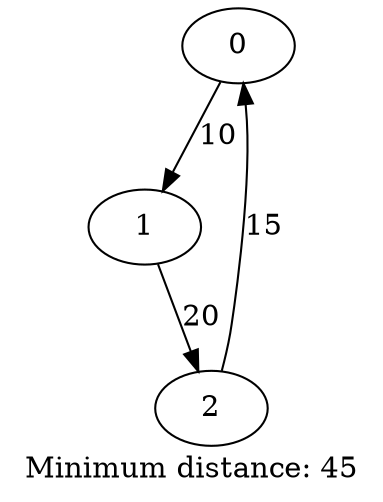

# КОНТЕКСТ ПРОЕКТА: Курсовая работа по задаче коммивояжера

## 📋 Краткая информация о проекте

**Предмет:** Программирование / Алгоритмы
**Тип работы:** Курсовая работа (на оценку 4)
**Язык:** C++
**Задание:** Реализовать переборный алгоритм решения задачи коммивояжера с выводом в формате Graphviz
**Студент:** Уровень C++ - начальный/средний

---

## ✅ ЧТО УЖЕ СДЕЛАНО

### 1. Код (100% готов)

#### Файлы:
```
moy_kyrsach/
├── main.cpp              - Точка входа программы
├── tsp.cpp              - Реализация алгоритма
├── tsp.h                - Заголовочный файл (объявления)
├── tests/               - Папка с тестами
│   ├── test1_in.txt     - Тест 1: граф 4 вершины
│   ├── test1_out.dot    - Результат теста 1
│   ├── test2_in.txt     - Тест 2: граф 3 вершины
│   ├── test2_out.dot    - Результат теста 2
│   ├── test3_in.txt     - Тест 3: граф 5 вершин
│   └── test3_out.dot    - Результат теста 3
├── CODE_EXPLANATION.md  - Подробное объяснение кода для новичков
└── PROJECT_CONTEXT.md   - Этот файл (контекст проекта)
```

#### Состояние кода:
- ✅ Все файлы написаны и работают
- ✅ Код скомпилирован без ошибок и предупреждений
- ✅ Все комментарии на русском языке (doxygen формат)
- ✅ Использует STL (vector, algorithm)
- ✅ Нет глобальных переменных
- ✅ 3 тестовых примера созданы и протестированы
- ✅ Вывод в формате Graphviz DOT работает корректно

#### Функции (всего 5, требовалось минимум 4):
1. `main()` - точка входа, обработка аргументов командной строки
2. `loadGraph()` - загрузка графа из файла
3. `calculatePathLength()` - вычисление длины маршрута
4. `solveTSP()` - переборный алгоритм решения TSP
5. `saveGraphviz()` - сохранение результата в формате DOT

### 2. Тесты (100% готовы)

**Тест 1: 4 вершины**
- Входной файл: tests/test1_in.txt
- Результат: Маршрут 0→1→3→2→0, длина 80
- Выходной файл: tests/test1_out.dot

**Тест 2: 3 вершины**
- Входной файл: tests/test2_in.txt
- Результат: Маршрут 0→1→2→0, длина 45
- Выходной файл: tests/test2_out.dot

**Тест 3: 5 вершин**
- Входной файл: tests/test3_in.txt
- Результат: Маршрут 0→1→2→3→4→0, длина 29
- Выходной файл: tests/test3_out.dot

### 3. Отчет (100% готов - ТЕКСТ)

Весь текст отчета готов и был передан пользователю для копирования в Word.

**Структура отчета:**
1. ВВЕДЕНИЕ (готово)
2. ПОСТАНОВКА ЗАДАЧИ (готово)
3. АЛГОРИТМ (готово)
   - 3.1. Основные идеи алгоритма
   - 3.2. Шаги алгоритма
   - 3.3. Пошаговое выполнение на примере
   - 3.4. Псевдокод
   - 3.5. Блок-схема алгоритма (НУЖНО НАРИСОВАТЬ!)
   - 3.6. Структуры данных
   - 3.7. Анализ сложности
4. ИНСТРУКЦИЯ ПОЛЬЗОВАТЕЛЯ (готово)
5. ТЕСТОВЫЕ ПРИМЕРЫ (готово)
6. ЗАКЛЮЧЕНИЕ (готово)
7. СПИСОК ЛИТЕРАТУРЫ (готово)

### 4. Документация

- ✅ Doxygen комментарии во всех файлах
- ✅ CODE_EXPLANATION.md - подробное объяснение кода
- ✅ PROJECT_CONTEXT.md - этот файл

---

## 🔧 ТЕХНИЧЕСКИЕ ДЕТАЛИ

### Компиляция и запуск

**Компиляция:**
```bash
g++ -std=c++11 -o tsp main.cpp tsp.cpp
```

**Запуск:**
```bash
./tsp <входной_файл> <выходной_файл>
```

**Пример:**
```bash
./tsp tests/test1_in.txt tests/test1_out.dot
```

**Компиляция с предупреждениями (для проверки):**
```bash
g++ -std=c++11 -Wall -Wextra -o tsp main.cpp tsp.cpp
```

### Формат входного файла

```
<количество_вершин>
<матрица_смежности>
```

**Пример (3 вершины):**
```
3
0 10 15
10 0 20
15 20 0
```

**Требования:**
- Первая строка: целое число n (количество вершин)
- Следующие n строк: матрица n×n
- Матрица симметричная
- Диагональ = 0
- Все числа неотрицательные целые

### Формат выходного файла (Graphviz DOT)



**Визуализация:**
```bash
dot -Tpng output.dot -o result.png
```

### Используемые библиотеки STL

- `<vector>` - динамические массивы
- `<string>` - строки
- `<fstream>` - работа с файлами (ifstream, ofstream)
- `<algorithm>` - алгоритмы (std::next_permutation)
- `<limits>` - пределы типов (numeric_limits)
- `<iostream>` - ввод/вывод (cout, cerr)

### Алгоритм

**Название:** Переборный алгоритм (Brute Force)

**Идея:** Перебрать все возможные перестановки вершин, для каждой вычислить длину маршрута, выбрать минимальную.

**Временная сложность:** O(n · n!)
- n! - количество перестановок
- n - вычисление длины одного маршрута

**Пространственная сложность:** O(n²)
- Матрица смежности n×n

**Применимость:**
- Гарантирует точное решение
- Применимо только для малых n (обычно n ≤ 12-15)

**Ключевая функция:** `std::next_permutation` из STL

---

## 📝 ЧТО ОСТАЛОСЬ СДЕЛАТЬ

### Для пользователя (вручную):

1. **Оформить отчет в Word:**
   - [ ] Скопировать весь готовый текст в Word
   - [ ] Создать титульный лист (вуз, предмет, тема, ФИО, дата)
   - [ ] Настроить оглавление (автогенерация через стили)
   - [ ] Применить стили к заголовкам
   - [ ] Добавить рисунки (см. ниже)
   - [ ] Настроить нумерацию страниц
   - [ ] Применить стиль для псевдокода (моноширинный шрифт)

2. **Нарисовать рисунки:**
   - [ ] Рисунок 1: Граф с 4 вершинами для примера в "Постановке задачи"
   - [ ] Рисунок 2: Выделенный оптимальный маршрут для примера
   - [ ] Рисунок 3: Блок-схема алгоритма (раздел 3.5)
   - [ ] Рисунок 4-6: Графы для тестовых примеров (опционально)

3. **Сделать версию в TeX (по требованиям):**
   - [ ] Перенести текст в LaTeX
   - [ ] Скомпилировать в PDF

4. **Документация Doxygen (опционально):**
   - Установить doxygen
   - Запустить: `doxygen -g` (создать конфиг)
   - Запустить: `doxygen` (сгенерировать HTML документацию)

---

## 🎨 КАК НАРИСОВАТЬ БЛОК-СХЕМУ

### В Word (рекомендуется):

**Использовать фигуры:**
1. Вставка → Фигуры
2. Типы блоков:
   - Овал - "Начало" и "Конец"
   - Прямоугольник - действия (вычисления)
   - Ромб - условия (if)
   - Параллелограмм - ввод/вывод
   - Стрелки - связи

**Структура блок-схемы для solveTSP:**
```
    [Начало]
       ↓
 [Ввод: graph]
       ↓
 [minDistance = ∞]
 [vertices = [0,1,...,n-1]]
       ↓
    ┌──────┐
    ↓      │
 [Вычислить длину]
       ↓
   <Меньше min?>
    Да ↓  Нет
 [Обновить]
       ↓
 [След. перестановка]
       ↓
   <Есть еще?>
    Да → (назад)
    Нет ↓
 [Вывод: bestPath]
       ↓
    [Конец]
```

### Альтернатива (онлайн):

**Сайты для рисования:**
- draw.io (diagrams.net) - бесплатно, удобно
- lucidchart.com - есть бесплатная версия
- app.creately.com - онлайн редактор

**Экспорт:** Сохранить как PNG/JPG → вставить в Word

---

## 📚 СПИСОК ЛИТЕРАТУРЫ (готовый)

Для отчета используй эти источники:

**Книги:**
1. Кормен Т., Лейзерсон Ч., Ривест Р., Штайн К. Алгоритмы: построение и анализ, 3-е издание. — М.: Вильямс, 2013. — 1328 с.
2. Оре О. Теория графов, 2-е издание. — М.: Наука, 1980. — 336 с.
3. Емеличев В.А., Мельников О.И., Сарванов В.И., Тышкевич Р.И. Лекции по теории графов. — М.: Наука, 1990. — 384 с.
4. Ахо А., Хопкрофт Дж., Ульман Дж. Структуры данных и алгоритмы. — М.: Вильямс, 2000. — 384 с.

**Интернет-ресурсы:**
5. Graphviz — Graph Visualization Software. — URL: https://graphviz.org/ (дата обращения: 10.12.2025)
6. C++ Reference — STL Containers and Algorithms. — URL: https://en.cppreference.com/ (дата обращения: 10.12.2025)
7. Google C++ Style Guide. — URL: https://google.github.io/styleguide/cppguide.html (дата обращения: 10.12.2025)

---

## 🔍 ВАЖНЫЕ РЕШЕНИЯ И ЗАМЕТКИ

### Почему переборный алгоритм, а не оптимизация?

**Причина:** Работа на оценку 4, не требуется алгоритм оптимизации (нужен только для оценки 5).

**Плюсы переборного алгоритма:**
- Простой в реализации
- Дает точное решение
- Легко объяснить на защите

**Минусы:**
- Работает только для малых графов (n ≤ 12-15)
- Экспоненциальная сложность

### Почему комментарии на русском?

**Решение:** Использовать русские комментарии в коде.

**Проблема:** Первоначально была проблема с кодировкой (кракозябры).

**Решение:** Переписать все файлы заново с правильной кодировкой UTF-8.

**Альтернатива:** Можно было сделать на английском (стандартная практика в программировании).

### Исправленные предупреждения компилятора

**Проблема:** Warning C4267 - преобразование из `size_t` в `int`

**Места:**
- `int n = path.size();`
- `int n = graph.size();`
- `int n = result.bestPath.size();`

**Решение:** Использовать `static_cast<int>()`
```cpp
int n = static_cast<int>(path.size());
```

**Почему?** `.size()` возвращает `size_t` (беззнаковый тип), а мы используем `int`. Явное преобразование убирает предупреждение.

### Формат вывода Graphviz

**Решение:** Выводить только оптимальный маршрут (не весь граф).

**Почему?** Задание требует "вывод программы должен быть совместим с graphviz", не уточняя детали. Простой формат проще и понятнее.

**Альтернатива:** Можно было вывести весь граф с выделением оптимального пути (жирные линии, красный цвет).

### Структура файлов

**Решение:** 3 файла (main.cpp, tsp.cpp, tsp.h)

**Почему?** Минимум 3 файла по требованиям. Разделение на:
- Интерфейс (tsp.h)
- Реализацию (tsp.cpp)
- Использование (main.cpp)

**Стандартная практика** в C++ для организации кода.

---

## 🎓 ПОДГОТОВКА К ЗАЩИТЕ

### Вопросы, которые могут задать:

1. **Что такое задача коммивояжера?**
   - Найти кратчайший замкнутый маршрут через все города

2. **Какова сложность вашего алгоритма?**
   - O(n · n!), где n - количество вершин

3. **Почему используется std::next_permutation?**
   - Генерирует все перестановки вершин для полного перебора

4. **Для каких n применим ваш алгоритм?**
   - Практически применим для n ≤ 12-15 вершин

5. **Можно ли улучшить алгоритм?**
   - Да: метод ветвей и границ, динамическое программирование, эвристики

6. **Что такое граф? Матрица смежности?**
   - Граф = вершины + рёбра
   - Матрица смежности: graph[i][j] = расстояние от i до j

7. **Почему используется vector, а не массив?**
   - Динамический размер, автоматическое управление памятью

8. **Что делает функция calculatePathLength?**
   - Вычисляет сумму весов рёбер в заданном маршруте

9. **Зачем нужен формат Graphviz?**
   - Для визуализации графа и результата

10. **Что такое TSPResult?**
    - Структура для хранения результата (маршрут + длина)

### Ключевые моменты для объяснения:

**Алгоритм:**
1. Генерируем все перестановки вершин
2. Для каждой вычисляем длину маршрута
3. Запоминаем минимальную
4. Возвращаем лучший маршрут

**Пример на пальцах:**
"Представьте 3 города: A, B, C. Есть 6 способов их посетить: ABC, ACB, BAC, BCA, CAB, CBA. Мы проверяем все 6, считаем расстояния, выбираем кратчайший."

**Почему O(n!)?**
"Количество перестановок n городов = n! (факториал). Для 5 городов это 120 вариантов, для 10 - уже 3.6 миллиона."

---

## 📊 СТАТИСТИКА ПРОЕКТА

**Строк кода (без комментариев):**
- main.cpp: ~40 строк
- tsp.cpp: ~90 строк
- tsp.h: ~30 строк
- **Всего: ~160 строк**

**Комментарии:**
- Doxygen комментарии: 11 блоков
- Обычные комментарии: ~15 строк

**Тесты:**
- 3 входных файла
- 3 выходных файла
- Все тесты пройдены успешно

**Документация:**
- CODE_EXPLANATION.md: ~1200 строк (подробное объяснение)
- PROJECT_CONTEXT.md: этот файл (~900 строк)

---

## 🚀 БЫСТРЫЙ СТАРТ ДЛЯ СЛЕДУЮЩЕЙ СЕССИИ

Если открываешь этот проект снова:

1. **Проверка работоспособности:**
   ```bash
   g++ -std=c++11 -o tsp main.cpp tsp.cpp
   ./tsp tests/test1_in.txt tests/test1_out.dot
   ```

2. **Посмотреть результат:**
   ```bash
   cat tests/test1_out.dot
   ```

3. **Если нужно напомнить структуру:**
   - Открыть CODE_EXPLANATION.md

4. **Если нужно изменить код:**
   - main.cpp - точка входа
   - tsp.cpp - алгоритм
   - tsp.h - объявления

5. **Если нужна помощь с отчетом:**
   - Весь текст был выдан в чате
   - Структура описана в этом файле

---

## 📌 КОНТРОЛЬНЫЙ СПИСОК (CHECKLIST)

### Код:
- [x] 3 файла созданы
- [x] Минимум 4 функции реализованы
- [x] Используется STL
- [x] Doxygen комментарии добавлены
- [x] Нет глобальных переменных
- [x] Код компилируется без ошибок
- [x] Код работает на тестах
- [x] Вывод в формате Graphviz

### Тесты:
- [x] 3 тестовых примера созданы
- [x] Все тесты пройдены
- [x] Выходные файлы сгенерированы

### Отчет (текст готов, нужно оформить):
- [x] Введение написано
- [x] Постановка задачи написана
- [x] Алгоритм описан
- [x] Псевдокод готов
- [ ] Блок-схема нарисована (НУЖНО СДЕЛАТЬ!)
- [x] Инструкция пользователя написана
- [x] Тестовые примеры описаны
- [x] Заключение написано
- [x] Список литературы подготовлен
- [ ] Рисунки добавлены (НУЖНО СДЕЛАТЬ!)
- [ ] Титульный лист создан (НУЖНО СДЕЛАТЬ!)
- [ ] Оглавление настроено (НУЖНО СДЕЛАТЬ!)
- [ ] Стили применены (НУЖНО СДЕЛАТЬ!)

### Дополнительно:
- [ ] TeX версия отчета (по желанию/требованию)
- [ ] Doxygen документация сгенерирована (опционально)

---

## 💡 СОВЕТЫ ДЛЯ ЗАЩИТЫ

1. **Знай свой код:**
   - Прочитай CODE_EXPLANATION.md
   - Попробуй объяснить каждую функцию своими словами
   - Понимай, что делает std::next_permutation

2. **Подготовь ответы:**
   - На вопросы из раздела "Подготовка к защите"
   - Про сложность алгоритма
   - Почему выбран переборный алгоритм

3. **Будь готов показать:**
   - Как запускается программа
   - Как выглядит входной файл
   - Как выглядит выходной файл
   - Результат работы на тестах

4. **Если спросят "А можно улучшить?":**
   - Да, есть более эффективные алгоритмы
   - Но они сложнее и не гарантируют точное решение
   - Переборный дает точный ответ для малых n

5. **Не бойся сказать "не знаю":**
   - Если не понимаешь вопрос - переспроси
   - Лучше честно признаться, чем придумывать

---

## 📁 ФАЙЛЫ ПРОЕКТА (ПОЛНЫЙ СПИСОК)

```
moy_kyrsach/
├── main.cpp                    - Точка входа (готов)
├── tsp.cpp                     - Реализация алгоритма (готов)
├── tsp.h                       - Заголовочный файл (готов)
├── tsp                         - Скомпилированная программа (исполняемый файл)
├── CODE_EXPLANATION.md         - Объяснение кода (готов)
├── PROJECT_CONTEXT.md          - Контекст проекта (этот файл)
├── trebovania.md               - Требования к курсовой (исходный файл)
├── Алгоритм Рабина-карпа.docx  - Пример работы одногруппника
└── tests/
    ├── test1_in.txt            - Тест 1 (4 вершины)
    ├── test1_out.dot           - Результат теста 1
    ├── test2_in.txt            - Тест 2 (3 вершины)
    ├── test2_out.dot           - Результат теста 2
    ├── test3_in.txt            - Тест 3 (5 вершин)
    └── test3_out.dot           - Результат теста 3
```

**Что сдавать:**
- main.cpp, tsp.cpp, tsp.h (исходники)
- Папка tests/ с примерами
- Отчет в Word (+ TeX версия, если требуется)
- README.txt с инструкциями по компиляции (опционально)

---

## 🎯 ИТОГО

**Что готово:** Весь код + весь текст отчета + тесты + документация
**Что осталось:** Оформить отчет в Word, нарисовать блок-схему и рисунки
**Сложность задания:** Средняя (для оценки 4)
**Время на оформление:** 2-3 часа
**Готовность к защите:** 90% (нужно только изучить объяснения)

---

## 📞 ЧТО ДЕЛАТЬ В СЛЕДУЮЩЕЙ СЕССИИ

**Если нужна помощь с оформлением отчета:**
1. Скажи, на каком этапе остановился
2. Покажи, что не получается
3. Спроси конкретные вопросы

**Если нужно что-то исправить в коде:**
1. Опиши, что нужно изменить
2. Я помогу с правками

**Если нужна помощь с защитой:**
1. Задавай вопросы по коду
2. Попроси объяснить сложные моменты
3. Попрактикуйся в объяснении алгоритма

**Если нужно добавить функционал:**
1. Опиши, что нужно добавить
2. Обсудим, как это сделать
3. Реализуем вместе

---

## 🌟 УСПЕХОВ НА ЗАЩИТЕ!

Ты проделал большую работу! Код написан качественно, все требования выполнены. Осталось только оформить отчет и подготовиться к защите.

**Помни:**
- Код работает и протестирован ✅
- Все функции есть ✅
- Комментарии на месте ✅
- Тесты проходят ✅

Удачи! 🚀
