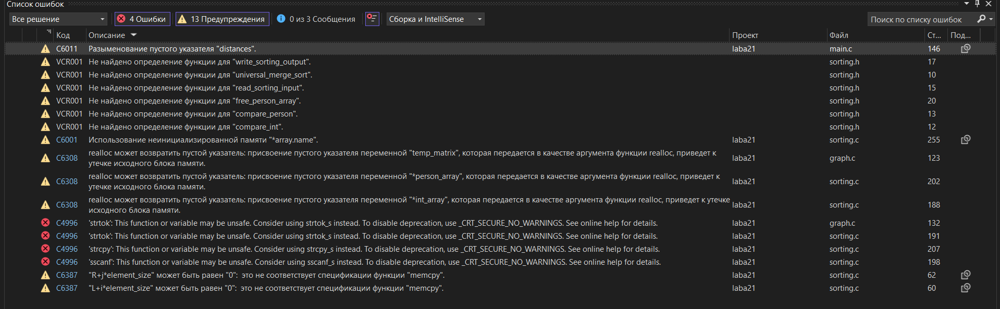

�����! ����� ��������� �� **2 ��������� ���������** � ������� ������� �����-������. ���������:

## ��������� 1: ���������� ��������

**1. ����: sorting.h**
```c
#ifndef SORTING_H
#define SORTING_H

#include <stdio.h>
#include <stdlib.h>
#include <string.h>

typedef struct {
    char* name;
    int age;
} Person;

void universal_merge_sort(void* array, int count, size_t size, 
                         int (*compare)(const void*, const void*));
int compare_int(const void* a, const void* b);
int compare_person(const void* a, const void* b);
void free_person_array(Person* array, int count);

void read_sorting_input(const char* filename, int** int_array, int* int_count,
                       Person** person_array, int* person_count);
void write_sorting_output(const char* filename, int* int_array, int int_count,
                         Person* person_array, int person_count);

#endif
```

**2. ����: sorting.c**
```c
#include "sorting.h"

int compare_int(const void* a, const void* b) {
    int int_a = *(const int*)a;
    int int_b = *(const int*)b;
    if (int_a < int_b) return -1;
    if (int_a > int_b) return 1;
    return 0;
}

int compare_person(const void* a, const void* b) {
    const Person* p1 = (const Person*)a;
    const Person* p2 = (const Person*)b;
    int name_cmp = strcmp(p1->name, p2->name);
    if (name_cmp != 0) return name_cmp;
    if (p1->age < p2->age) return -1;
    if (p1->age > p2->age) return 1;
    return 0;
}

void free_person_array(Person* array, int count) {
    if (array == NULL) return;
    for (int i = 0; i < count; i++) {
        free(array[i].name);
    }
    free(array);
}

static void merge(void* array, int left, int mid, int right, 
                 size_t element_size, int (*compare)(const void*, const void*)) {
    int n1 = mid - left + 1;
    int n2 = right - mid;

    char* L = (char*)malloc(n1 * element_size);
    char* R = (char*)malloc(n2 * element_size);
    char* arr = (char*)array;

    for (int i = 0; i < n1; i++)
        memcpy(L + i * element_size, arr + (left + i) * element_size, element_size);
    for (int j = 0; j < n2; j++)
        memcpy(R + j * element_size, arr + (mid + 1 + j) * element_size, element_size);

    int i = 0, j = 0, k = left;
    while (i < n1 && j < n2) {
        if (compare(L + i * element_size, R + j * element_size) <= 0) {
            memcpy(arr + k * element_size, L + i * element_size, element_size);
            i++;
        } else {
            memcpy(arr + k * element_size, R + j * element_size, element_size);
            j++;
        }
        k++;
    }

    while (i < n1) {
        memcpy(arr + k * element_size, L + i * element_size, element_size);
        i++; k++;
    }
    while (j < n2) {
        memcpy(arr + k * element_size, R + j * element_size, element_size);
        j++; k++;
    }

    free(L);
    free(R);
}

static void merge_sort(void* array, int left, int right, 
                      size_t element_size, int (*compare)(const void*, const void*)) {
    if (left < right) {
        int mid = left + (right - left) / 2;
        merge_sort(array, left, mid, element_size, compare);
        merge_sort(array, mid + 1, right, element_size, compare);
        merge(array, left, mid, right, element_size, compare);
    }
}

void universal_merge_sort(void* array, int count, size_t size, 
                         int (*compare)(const void*, const void*)) {
    if (count > 0 && array != NULL) {
        merge_sort(array, 0, count - 1, size, compare);
    }
}

void read_sorting_input(const char* filename, int** int_array, int* int_count,
                       Person** person_array, int* person_count) {
    FILE* file = fopen(filename, "r");
    if (!file) {
        printf("Oshibka otkrytiya faila %s\n", filename);
        exit(1);
    }

    int int_capacity = 10, person_capacity = 10;
    *int_array = (int*)malloc(int_capacity * sizeof(int));
    *person_array = (Person*)malloc(person_capacity * sizeof(Person));
    *int_count = *person_count = 0;
    
    char line[1024];
    int section = 0;
    

    while (fgets(line, sizeof(line), file)) {
        line[strcspn(line, "\n")] = 0;
        if (strlen(line) == 0) continue;

        if (strstr(line, "CELYE CHISLA") != NULL) {
            section = 1; continue;
        } else if (strstr(line, "STRUCT PERSON") != NULL) {
            section = 2; continue;
        }

        switch (section) {
            case 1: {
                char* token = strtok(line, " \t");
                while (token) {
                    if (*int_count >= int_capacity) {
                        int_capacity *= 2;
                        *int_array = (int*)realloc(*int_array, int_capacity * sizeof(int));
                    }
                    (*int_array)[(*int_count)++] = atoi(token);
                    token = strtok(NULL, " \t");
                }
                break;
            }
            case 2: {
                char name[256];
                int age;
                if (sscanf(line, "%255s %d", name, &age) == 2) {
                    if (*person_count >= person_capacity) {
                        person_capacity *= 2;
                        *person_array = (Person*)realloc(*person_array, person_capacity * sizeof(Person));
                    }
                    (*person_array)[*person_count].name = (char*)malloc(strlen(name) + 1);
                    strcpy((*person_array)[*person_count].name, name);
                    (*person_array)[*person_count].age = age;
                    (*person_count)++;
                }
                break;
            }
        }
    }
    fclose(file);
}

void write_sorting_output(const char* filename, int* int_array, int int_count,
                         Person* person_array, int person_count) {
    FILE* file = fopen(filename, "w");
    if (!file) {
        printf("Oshibka sozdaniya faila %s\n", filename);
        return;
    }

    fprintf(file, "=== REZULTATY SORTIROVKI CELYH CHISEL ===\n");
    for (int i = 0; i < int_count; i++) {
        fprintf(file, "%d", int_array[i]);
        if (i < int_count - 1) fprintf(file, " ");
    }
    fprintf(file, "\n\n");

    fprintf(file, "=== REZULTATY SORTIROVKI STRUCT PERSON ===\n");
    for (int i = 0; i < person_count; i++) {
        fprintf(file, "%s %d\n", person_array[i].name, person_array[i].age);
    }

    fclose(file);
}
```

**3. ����: main_sorting.c** (��������� 1)
```c
#include "sorting.h"
#include <stdio.h>
#include <stdlib.h>

int main() {
    printf("PROGRAMMA 1: UNIVERSALNAYA SORTIROVKA SLIYANIEM\n");
    
    int* int_array = NULL;
    int int_count = 0;
    Person* person_array = NULL;
    int person_count = 0;

    read_sorting_input("input_sort.txt", &int_array, &int_count,
                      &person_array, &person_count);

    printf("Dannye zagruzheny:\n");
    printf("- Celye chisla: %d elementov\n", int_count);
    printf("- Struktury Person: %d elementov\n", person_count);

    if (int_count > 0) {
        universal_merge_sort(int_array, int_count, sizeof(int), compare_int);
        printf("Massiv celyh chisel otsortirovan\n");
    }

    if (person_count > 0) {
        universal_merge_sort(person_array, person_count, sizeof(Person), compare_person);
        printf("Massiv struktur Person otsortirovan\n");
    }

    write_sorting_output("output_sort.txt", int_array, int_count,
                        person_array, person_count);
    printf("Rezultaty zapisany v output_sort.txt\n");

    if (int_array) free(int_array);
    if (person_array) free_person_array(person_array, person_count);

    printf("Programma 1 zavershena\n");
    return 0;
}
```

## ��������� 2: �������� ��������-�����

**4. ����: graph.h**
```c
#ifndef GRAPH_H
#define GRAPH_H

#include <stdio.h>
#include <stdlib.h>
#include <limits.h>

#define INF INT_MAX

void bellman_ford(int** graph, int vertices, int start_vertex, int* distances);
int has_negative_cycle(int** graph, int vertices, int start_vertex);
int** read_graph_input(const char* filename, int* vertices);
void write_graph_output(const char* filename, int* distances, int vertices, int start_vertex);

#endif
```


**5. ����: graph.c**
```c
#include "graph.h"

void bellman_ford(int** graph, int vertices, int start_vertex, int* distances) {
    for (int i = 0; i < vertices; i++)
        distances[i] = INF;
    distances[start_vertex] = 0;

    for (int i = 0; i < vertices - 1; i++) {
        for (int u = 0; u < vertices; u++) {
            if (distances[u] == INF) continue;
            for (int v = 0; v < vertices; v++) {
                if (graph[u][v] != 0) {
                    long long new_dist = (long long)distances[u] + graph[u][v];
                    if (new_dist < distances[v]) {
                        distances[v] = (int)new_dist;
                    }
                }
            }
        }
    }
}

int has_negative_cycle(int** graph, int vertices, int start_vertex) {
    int* distances = (int*)malloc(vertices * sizeof(int));
    if (distances == NULL) return 0;

    bellman_ford(graph, vertices, start_vertex, distances);

    for (int u = 0; u < vertices; u++) {
        if (distances[u] == INF) continue;
        for (int v = 0; v < vertices; v++) {
            if (graph[u][v] != 0) {
                long long new_dist = (long long)distances[u] + graph[u][v];
                if (new_dist < distances[v]) {
                    free(distances);
                    return 1;
                }
            }
        }
    }

    free(distances);
    return 0;
}

int** read_graph_input(const char* filename, int* vertices) {
    FILE* file = fopen(filename, "r");
    if (!file) {
        printf("Oshibka otkrytiya faila %s\n", filename);
        return NULL;
    }

    int** temp_matrix = (int**)malloc(10 * sizeof(int*));
    int matrix_capacity = 10;
    int matrix_rows = 0;
    *vertices = 0;
    
    char line[1024];
    int section = 0;

    while (fgets(line, sizeof(line), file)) {
        line[strcspn(line, "\n")] = 0;
        if (strlen(line) == 0) continue;

        if (strstr(line, "MATRICA SMEJNOSTI") != NULL) {
            section = 1;
            continue;
        }

        if (section == 1) {
            if (matrix_rows >= matrix_capacity) {
                matrix_capacity *= 2;
                temp_matrix = (int**)realloc(temp_matrix, matrix_capacity * sizeof(int*));
            }

            int values[256];
            int count = 0;
            char* token = strtok(line, " \t");
            while (token && count < 256) {
                values[count++] = atoi(token);
                token = strtok(NULL, " \t");
            }

            if (count > 0) {
                temp_matrix[matrix_rows] = (int*)malloc(count * sizeof(int));
                for (int i = 0; i < count; i++) {
                    temp_matrix[matrix_rows][i] = values[i];
                }
                if (count > *vertices) *vertices = count;
                matrix_rows++;
            }
        }
    }
    fclose(file);

    if (matrix_rows > 0) {
        *vertices = (matrix_rows > *vertices) ? matrix_rows : *vertices;
        int** graph = (int**)malloc(*vertices * sizeof(int*));
        
        for (int i = 0; i < *vertices; i++) {
            graph[i] = (int*)malloc(*vertices * sizeof(int));
            for (int j = 0; j < *vertices; j++) {
                if (i < matrix_rows && j < matrix_rows) {
                    graph[i][j] = temp_matrix[i][j];
                } else {
                    graph[i][j] = 0;
                }
            }
        }

        for (int i = 0; i < matrix_rows; i++) {
            free(temp_matrix[i]);
        }
        free(temp_matrix);
        
        return graph;
    }

    free(temp_matrix);
    return NULL;
}

void write_graph_output(const char* filename, int* distances, int vertices, int start_vertex) {
    FILE* file = fopen(filename, "w");
    if (!file) {
        printf("Oshibka sozdaniya faila %s\n", filename);
        return;
    }

    

    fprintf(file, "=== REZULTATY ALGORITMA BELLMANA-FORDA ===\n");
    fprintf(file, "Kratchajshie puti iz vershiny %d:\n", start_vertex);
    for (int i = 0; i < vertices; i++) {
        if (distances[i] == INF) {
            fprintf(file, "Vershina %d: nedostizhima\n", i);
        } else {
            fprintf(file, "Vershina %d: %d\n", i, distances[i]);
        }
    }

    fclose(file);
}
```

**6. ����: main_graph.c** (��������� 2)
```c
#include "graph.h"
#include <stdio.h>
#include <stdlib.h>

int main() {
    printf("PROGRAMMA 2: ALGORITM BELLMANA-FORDA\n");
    
    int vertices = 0;
    int** graph = read_graph_input("input_graph.txt", &vertices);
    
    if (graph == NULL || vertices == 0) {
        printf("Oshibka zagruzki grafa\n");
        return 1;
    }

    printf("Graf zagruzhen: %d vershin\n", vertices);
    
    int start_vertex = 0;
    int* distances = (int*)malloc(vertices * sizeof(int));
    
    if (has_negative_cycle(graph, vertices, start_vertex)) {
        printf("Obnaruzhen otricatelnyj cikl!\n");
    } else {
        bellman_ford(graph, vertices, start_vertex, distances);
        printf("Kratchajshie puti naydeny\n");
    }

    write_graph_output("output_graph.txt", distances, vertices, start_vertex);
    printf("Rezultaty zapisany v output_graph.txt\n");

    for (int i = 0; i < vertices; i++) {
        free(graph[i]);
    }
    free(graph);
    free(distances);

    printf("Programma 2 zavershena\n");
    return 0;
}
```

## ����� �����:

**input_sort.txt** (��� ��������� 1):
```
CELYE CHISLA
5 2 8 1 9 3 7 4 6 0

STRUCT PERSON
Ivan 25
Anna 30
Peter 20
Maria 35
Alex 28
```

**input_graph.txt** (��� ��������� 2):
```
MATRICA SMEJNOSTI
0 6 0 7 0
0 0 5 8 -4
0 -2 0 0 0
0 0 -3 0 9
2 0 7 0 0
```

������ **2 ��������� ���������** � ������� ������� �����-������!

������ ��� �� ��� ��� �������� ��� �� �� 3 ����� � �� 4 ��� ���������
���� ���������� ��������� ����� ������ ��� � ���� ���� 3
� ���� ����� ��� 4 ����� ������ ���� �����

